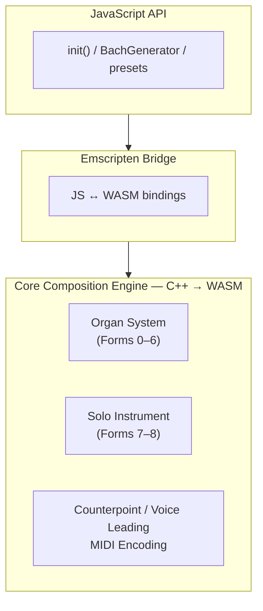
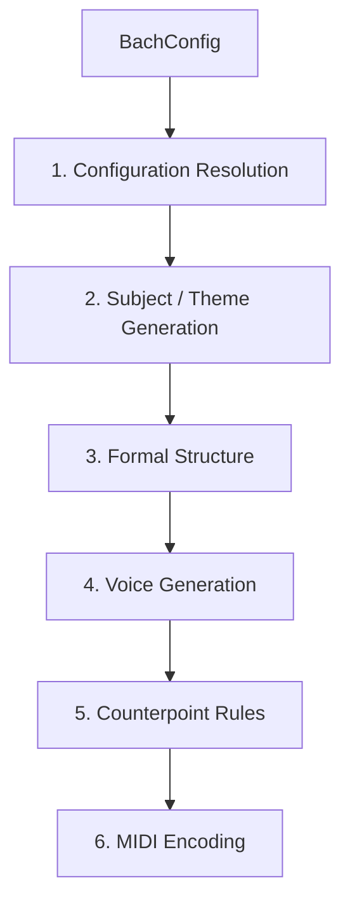

# Architecture

## Overview

::: info What is MIDI Sketch Bach?
MIDI Sketch Bach is an algorithmic composition engine that generates Baroque-style instrumental MIDI using rule-based counterpoint, not machine learning. Every note is determined by music theory constraints and deterministic algorithms, producing editable MIDI data you can import into any DAW.
:::

MIDI Sketch Bach compiles a core composition engine into WebAssembly, providing a high-level JavaScript API on top:

## Two Composition Systems

### Organ System (Forms 0--6)

The Organ System handles the large-scale organ works -- seven forms spanning the major genres of Bach's organ repertoire:

- **Fugue** (0) -- standalone fugue with exposition, development, and stretto
- **Prelude and Fugue** (1) -- flowing prelude leading into an elaborate fugue
- **Trio Sonata** (2) -- three-voice texture (two upper voices + pedal bass)
- **Chorale Prelude** (3) -- cantus firmus treatment with independent accompaniment
- **Toccata and Fugue** (4) -- multi-section piece with free toccata and strict fugue
- **Passacaglia** (5) -- continuous variation form over an ostinato bass
- **Fantasia and Fugue** (6) -- free-form fantasia paired with a structured fugue

These forms typically use 3--4 voices and default to organ registration.

### Solo Instrument System (Forms 7--8)

The Solo Instrument System handles works for unaccompanied string instruments:

- **Cello Prelude** (7) -- flowing prelude for solo cello, modeled on Bach's Cello Suites
- **Chaconne** (8) -- monumental variation form for solo violin, inspired by the Partita No. 2 Chaconne

These forms use 3 voices and default to cello or violin.

## Generation Pipeline

When you call `generator.generate(config)`, a six-step pipeline executes. For a detailed breakdown of each step, see the [Generation Pipeline](/docs/generation-pipeline) page.

1. **Configuration Resolution** -- Resolve all options, apply form defaults for unspecified fields
2. **Subject/Theme Generation** -- Generate primary melodic material based on key, mode, and character
3. **Formal Structure** -- Build the macro-level structure (exposition, episodes, variations, etc.)
4. **Voice Generation** -- Generate each voice independently within its register
5. **Counterpoint Rules** -- Validate and adjust interval relationships between voices
6. **MIDI Encoding** -- Map to Standard MIDI File format

::: tip
See [Generation Pipeline](/docs/generation-pipeline) for detailed explanations of each step, including how different form families handle structure differently.
:::

## Voice Architecture

Each voice in a MIDI Sketch Bach composition operates as an independent melodic line, following Baroque conventions for voice independence and voice leading. For a deep dive, see the [Voice Architecture](/docs/voice-architecture) page.

Key principles:

- **Registral separation** -- voices have distinct ranges that minimize overlap
- **Rhythmic independence** -- different rhythmic patterns maintain voice identity
- **Stepwise motion preferred** -- voices move by step more often than by leap
- **Leap resolution** -- large leaps are followed by stepwise motion in the opposite direction
- **Cadential patterns** -- standard formulas close phrases and sections

::: tip
See [Counterpoint & Voice Leading](/docs/counterpoint) for the music theory rules governing how voices interact.
:::

## WASM Integration

The composition engine is compiled to WebAssembly for portable, high-performance execution:

- **Initialization**: `init()` loads and instantiates the WASM module
- **Memory management**: `BachGenerator` allocates WASM memory; `destroy()` frees it
- **Data transfer**: MIDI output is copied from WASM memory to a JavaScript `Uint8Array`
- **Event data**: Structured event data is serialized from WASM and parsed in JavaScript
