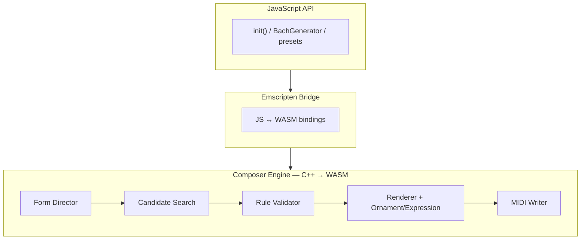

# Architecture

## Overview

::: info What is MIDI Sketch Bach?
MIDI Sketch Bach is an algorithmic composition engine that generates Baroque-style instrumental MIDI using rule-based composition, not machine learning. Every note is determined by a harmonic plan and counterpoint constraints, producing editable MIDI you can import into any DAW.
:::

A C++ composer engine is compiled to WebAssembly, with a JavaScript API on top:

```mermaid
graph TD
    subgraph JS["JavaScript API"]
        A["init() / BachGenerator / presets"]
    end
    subgraph EM["Emscripten Bridge"]
        B["JS ↔ WASM bindings"]
    end
    subgraph CORE["Composer Engine — C++ → WASM"]
        C["Form Director"]
        D["Candidate Search"]
        E["Rule Validator"]
        F["Renderer + Ornament/Expression"]
        G["MIDI Writer"]
        C --> D --> E --> F --> G
    end
    JS --> EM --> CORE
```

## The Composer Engine

A single composer subsystem handles every form. Rather than separate generators per genre, the engine expresses each form as a **layout of voice intents** over a harmonic plan, then fills, validates, and renders that layout. The form decides the texture (voice count, meter, natural length); there is no voice-count option.

The pipeline is:

1. **Compose Request** — resolve and validate the config; resolve the seed; fix voice count / meter / length from the form.
2. **Form Director** — assign per-form voice intents (subjects, grounds, cantus firmus, figuration, variations) to bar spans.
3. **Candidate Search** — per-beat, chord-tone-anchored note selection against the harmonic plan.
4. **Rule Validator** — counterpoint and structure checks, fail-fast.
5. **Renderer** — voices to tracks.
6. **Ornament & Expression** — opt-in deterministic post-passes.
7. **MIDI Writer** — key transposition and Standard MIDI File output.

See the [Generation Pipeline](/docs/generation-pipeline) for a step-by-step breakdown.

## Design-Value Arc

Structure follows a fixed design arc — **establish → develop → climax (at ~80% of the span) → resolve** — that controls density, register, and velocity tiers. The arc is a property of the form, not something searched per seed, which keeps output musically shaped and reproducible.

## Form Families

The form director handles several layout families:

- **Fugal** (`fugue`, `prelude_and_fugue`, `toccata_and_fugue`, `fantasia_and_fugue`) — subject/answer entries with episodes.
- **Ground-bass variation** (`passacaglia`, `chaconne`, `goldberg_variations`) — an immutable bass with successive variation cycles; `goldberg_variations` builds an aria plus thirty variations including canons at widening intervals, and `passacaglia`/`chaconne` run their cycles in 3/4.
- **Cantus firmus** (`chorale_prelude`) — a fixed chorale line plus a contrapuntal voice.
- **Linear / figural** (`trio_sonata`, `cello_prelude`) — interacting or continuous figuration.

## Determinism

The engine is fully deterministic: the same config and seed produce byte-identical output. Composition runs internally in C; the requested key is applied only by the MIDI writer, so the events JSON always reports pitches in C while the `.mid` file is transposed.

## WASM Integration

- **Initialization**: `init()` loads and instantiates the WASM module.
- **Memory management**: `BachGenerator` allocates WASM memory; `destroy()` frees it.
- **Data transfer**: MIDI output is copied from WASM memory to a JavaScript `Uint8Array`; event data is serialized from WASM and parsed in JavaScript.
