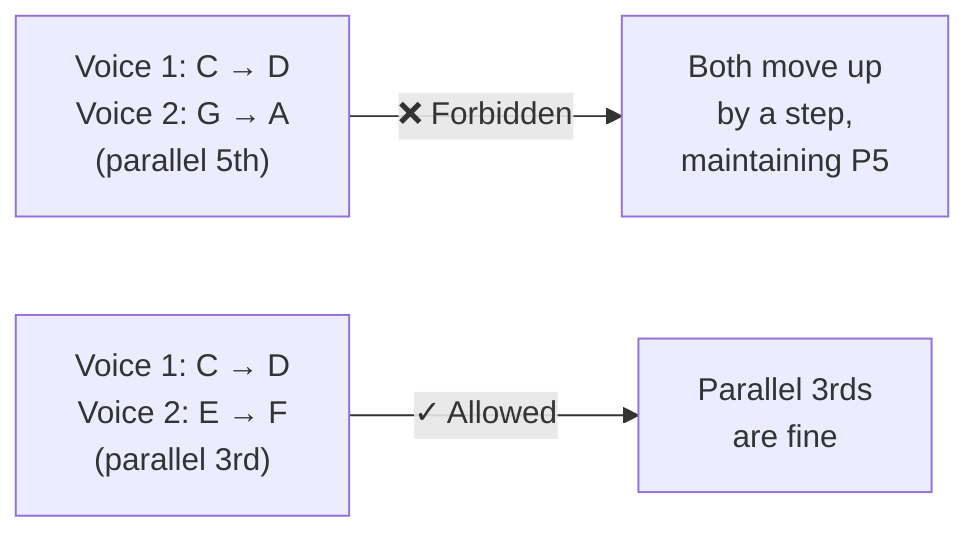
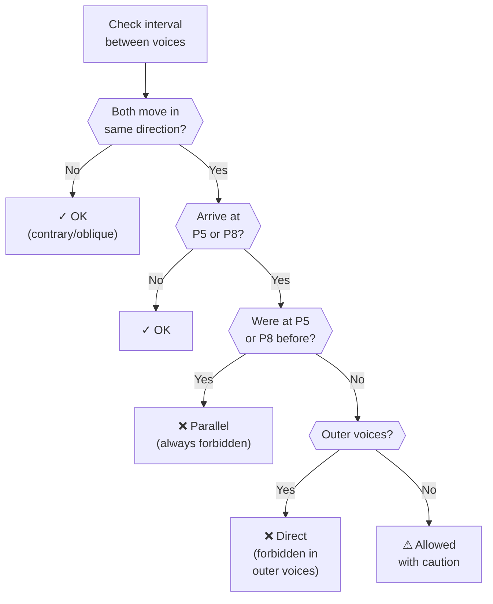
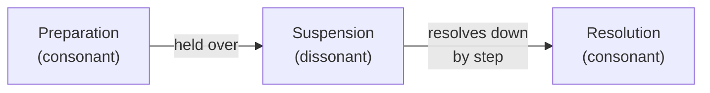
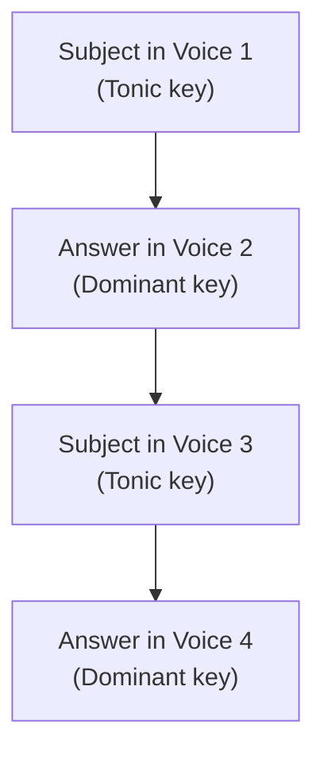

# Counterpoint & Voice Leading

This page explains the music theory rules that MIDI Sketch Bach uses to generate authentic Baroque-style counterpoint. These rules govern how multiple independent melodic lines (voices) interact with each other.

::: info Counterpoint for Engineers
Think of counterpoint as a constraint satisfaction problem. Each voice is an independent thread that must satisfy interval constraints relative to every other voice at every beat. The rules below are the constraints; the engine finds solutions that satisfy all of them simultaneously while also sounding musically compelling.
:::

## Consonance and Dissonance

In Baroque counterpoint, every interval between two voices is classified as consonant (stable, restful) or dissonant (unstable, requiring resolution).

### Interval Classification

| Interval | Semitones | Classification | Usage |
|----------|-----------|----------------|-------|
| Unison | 0 | Perfect consonance | Beginnings and endings |
| Minor 2nd | 1 | Dissonance | Passing tones, suspensions |
| Major 2nd | 2 | Dissonance | Passing tones, suspensions |
| Minor 3rd | 3 | Imperfect consonance | Freely used |
| Major 3rd | 4 | Imperfect consonance | Freely used |
| Perfect 4th | 5 | Context-dependent | Consonant in upper voices; dissonant against bass |
| Tritone | 6 | Dissonance | Must resolve |
| Perfect 5th | 7 | Perfect consonance | Strong harmonic support |
| Minor 6th | 8 | Imperfect consonance | Freely used |
| Major 6th | 9 | Imperfect consonance | Freely used |
| Minor 7th | 10 | Dissonance | Suspensions, dominant function |
| Major 7th | 11 | Dissonance | Suspensions, leading tone |
| Octave | 12 | Perfect consonance | Beginnings and endings |

::: tip
Imperfect consonances (3rds and 6ths) are the "sweet spot" of counterpoint — they sound harmonious while allowing voice independence. The engine favors these intervals in normal contrapuntal motion.
:::

## Forbidden Parallels

The most fundamental rules of Baroque counterpoint concern *parallel motion* — when two voices move in the same direction by the same interval.

::: warning Parallel Fifths and Octaves
Two voices must never move in parallel fifths (both voices moving up or down while maintaining a perfect 5th between them) or parallel octaves/unisons. These parallels destroy voice independence by making the two voices sound like a single doubled line.
:::

The engine also checks for **direct (hidden) fifths and octaves**: when two voices move in the same direction to arrive at a perfect 5th or octave, even if they weren't at that interval before. These are avoided in outer voices (soprano and bass).

### Validation Flow

## Dissonance Treatment

In Baroque counterpoint, dissonances are never left unresolved. Every dissonance must be introduced and resolved according to specific patterns.

### Suspensions

A suspension is the most expressive form of dissonance treatment — a consonant note is *held over* (suspended) into a beat where it becomes dissonant, then resolves downward by step.

Common suspension types:

| Suspension | Intervals | Resolution |
|------------|-----------|------------|
| 4-3 | 4th resolves to 3rd | Most common in upper voices |
| 7-6 | 7th resolves to 6th | Common in upper voices |
| 9-8 | 9th resolves to octave | Creates strong tension |
| 2-3 | 2nd resolves to 3rd | "Bass suspension" (resolves upward) |

::: tip
Suspensions are one of the primary sources of expressive beauty in Baroque counterpoint. The momentary clash between the held note and the moving voice creates emotional tension that resolves satisfyingly. Bach used suspensions extensively, especially in slow movements and chorale preludes.
:::

### Passing Tones

A passing tone fills in the gap between two consonant notes by stepwise motion. It occurs on a weak beat and connects two consonances:

- The note before is consonant
- The passing tone is dissonant (on a weak beat)
- The note after is consonant
- Motion is stepwise in one direction

### Neighbor Tones

A neighbor tone decorates a consonant note by stepping away and returning:

- Start on a consonance
- Move by step to a dissonance (on a weak beat)
- Return by step to the original note

## Voice Leading Principles

### Stepwise Motion

Voices should move predominantly by step (seconds). Leaps (thirds or larger) should be used sparingly and deliberately:

| Motion Type | Interval | Usage |
|-------------|----------|-------|
| Step | 2nd (1-2 semitones) | Primary motion, always available |
| Small leap | 3rd (3-4 semitones) | Common, adds melodic interest |
| Medium leap | 4th-5th (5-7 semitones) | Used for structural points |
| Large leap | 6th+ (8+ semitones) | Rare, must be resolved |

### Leap Resolution

When a voice does leap, the following rules apply:

- **After a large leap (6th or more)**: the voice must move by step in the opposite direction
- **After two consecutive leaps**: the voice should change direction
- **Leaps should outline consonant intervals**: 3rds, 4ths, 5ths, 6ths, octaves

### Contrary Motion

When possible, voices should move in opposite directions (*contrary motion*). This is the most effective way to maintain voice independence:

| Motion Type | Description | Independence |
|-------------|-------------|-------------|
| Contrary | Voices move in opposite directions | Strongest |
| Oblique | One voice moves, the other holds | Strong |
| Similar | Same direction, different intervals | Moderate |
| Parallel | Same direction, same interval | Weakest (restricted) |

### Voice Crossing Avoidance

Voices should generally stay in their assigned registers. When the alto line goes above the soprano, or the tenor goes below the bass, it creates confusion about which voice is which. The engine prevents unnecessary voice crossing while allowing it where musically justified (e.g., in dense stretto passages).

## Cadential Formulas

Cadences are the "punctuation marks" of music — they define phrase endings and structural boundaries.

::: info Cadences as Musical Punctuation
Just as sentences need periods and commas, musical phrases need cadences. A half cadence is like a comma (pause but continuing), while an authentic cadence is like a period (full stop). The engine places cadences according to the formal structure determined in the generation pipeline.
:::

### Cadence Types

| Cadence | Harmonic Motion | Musical Effect | Typical Placement |
|---------|----------------|----------------|-------------------|
| Authentic (Perfect) | V → I | Full closure, finality | End of sections, final cadence |
| Half | → V | Open, expectant | Mid-phrase, transition points |
| Deceptive | V → vi | Surprise, continuation | Extension of phrases |
| Plagal | IV → I | "Amen" cadence, gentle closure | Supplementary endings |

## Fugal Counterpoint

Fugues have additional counterpoint rules beyond the general principles.

### Subject and Answer

When the subject enters in a second voice, it is transposed to the dominant key (a 5th higher or 4th lower). This transposition — the *answer* — may be:

- **Real answer**: Exact transposition to the dominant
- **Tonal answer**: Modified to preserve the tonic-dominant relationship at key structural points

### Countersubject

A countersubject is a secondary theme that accompanies the subject whenever it appears. It is designed to be invertible — it works both above and below the subject.

### Stretto

In stretto, voices enter with the subject before the previous voice has finished stating it. This creates overlapping entries that build intensity:

The closer the entries, the more intense the stretto. Bach often saved the closest stretto for the climactic moments near the end of a fugue.

## Ostinato-Based Forms

In the Passacaglia and Chaconne, the bass theme (passacaglia) or harmonic progression (chaconne) repeats throughout the piece. Additional counterpoint constraints apply:

- The bass pattern must remain recognizable across all variations
- Upper voices gain increasing independence and complexity
- Voice count may increase as variations progress
- The final variations often feature the densest counterpoint

## Cantus Firmus Treatment

In the Chorale Prelude, a pre-existing melody (the cantus firmus) appears in long notes in one voice. The counterpoint rules for the accompanying voices include:

- Voices must not obscure the cantus firmus melody
- Accompanying voices should be rhythmically active to contrast with the long cantus firmus notes
- Harmonic intervals with the cantus firmus must follow standard consonance/dissonance rules
- Each phrase of the cantus firmus is typically preceded by a brief anticipatory passage in the accompanying voices
