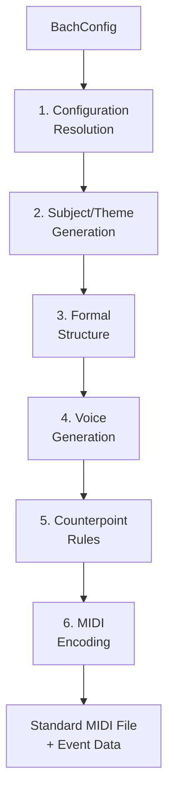
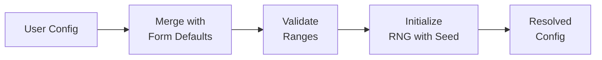
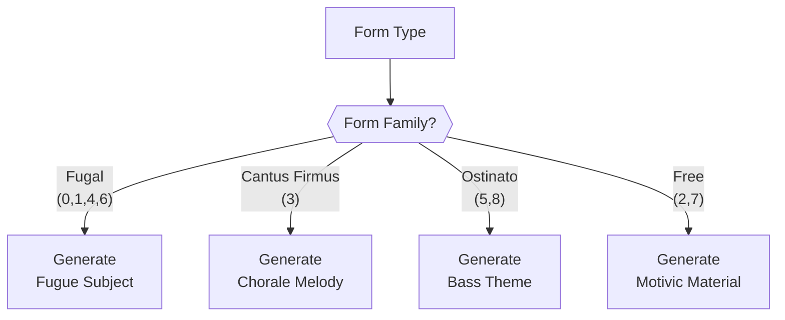
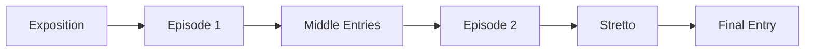
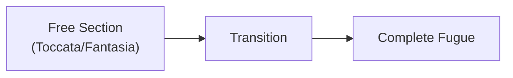
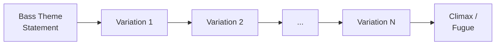
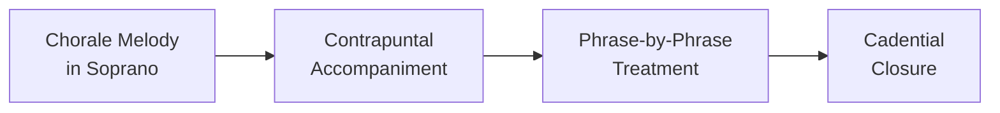
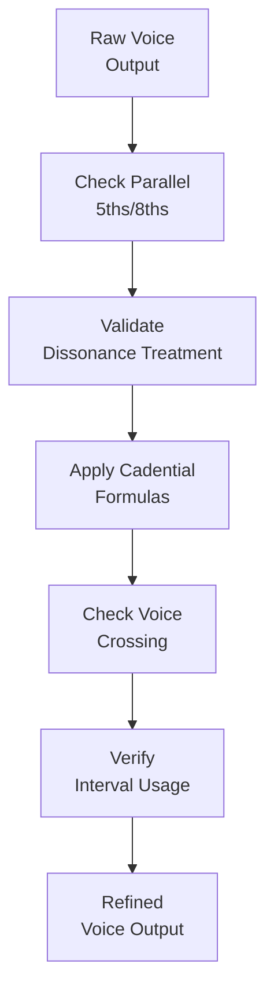

# Generation Pipeline

When you call `generator.generate(config)`, the engine executes a six-step pipeline that transforms a configuration object into a complete Bach-style composition.



## Step 1: Configuration Resolution

The engine resolves all configuration options, filling in defaults for unspecified fields. Each form defines a default instrument, voice count, and tempo.



::: info How Defaults Cascade
When you specify `form: 'fugue'` without other options, the engine applies: instrument = organ, voices = 4, BPM = 85. Any field you explicitly set overrides the form default. See [Option Relationships](/docs/option-relationships) for the complete dependency graph.
:::

| Field | Resolution Order |
|-------|-----------------|
| `form` | Required (default: 0 = Fugue) |
| `instrument` | User value → form default |
| `numVoices` | User value → form default |
| `bpm` | User value → form default (0 uses form default) |
| `key` | User value → 0 (C) |
| `isMinor` | User value → false (major) |
| `seed` | User value → 0 (random) |
| `scale` | User value → 1 (medium) |
| `targetBars` | User value → determined by scale |
| `character` | User value → 0 (balanced) |

## Step 2: Subject/Theme Generation

The engine generates the primary melodic material that will serve as the compositional seed for the entire piece. The approach varies by form family.



::: info What is a Fugue Subject?
In Baroque music, the fugue subject (Latin: *subjectum*) is a short melodic theme — typically 1 to 4 bars — that serves as the entire fugue's foundation. Every voice will eventually state this subject, and all episodes and development sections derive from it. The quality of the subject largely determines the quality of the entire fugue.
:::

### Character Influence

The `character` parameter shapes the melodic profile of the generated theme:

| Character | Effect on Subject |
|-----------|-------------------|
| 0 (Balanced) | Mix of steps and leaps, moderate rhythm |
| 1 (Lyrical) | Predominantly stepwise motion, smooth contour |
| 2 (Energetic) | Wider intervals, more rhythmic variety |
| 3 (Dramatic) | Bold leaps, dotted rhythms, chromatic elements |

## Step 3: Formal Structure

The engine plans the macro-level structure of the piece. This is where different form families diverge most significantly.

### Fugal Forms (Fugue, Prelude and Fugue, Toccata and Fugue, Fantasia and Fugue)



The fugue structure follows a well-defined plan:

- **Exposition**: Each voice enters in turn with the subject. The first answer is typically at the fifth (dominant).
- **Episodes**: Free counterpoint that modulates to related keys, often derived from the subject.
- **Middle entries**: The subject appears in new keys (relative major/minor, subdominant, etc.).
- **Stretto**: Voices enter with the subject in increasingly close overlap, building tension.
- **Final entry**: The subject returns in the home key for a conclusive statement.

For compound forms like Toccata and Fugue or Fantasia and Fugue, a free section precedes the fugue:



### Variation Forms (Passacaglia, Chaconne)



- The bass theme (passacaglia) or harmonic progression (chaconne) repeats throughout
- Each variation adds new melodic and rhythmic material
- Texture and complexity build progressively
- The `scale` parameter controls the number of variations

### Cantus Firmus Forms (Chorale Prelude)



- The chorale melody appears in long notes in one voice (typically soprano)
- Other voices weave independent contrapuntal lines around it
- Each phrase of the chorale is treated as a unit

### Trio Sonata / Cello Prelude

These forms follow their own structural conventions — the trio sonata with two interacting upper voices over a bass, and the cello prelude with continuous arpeggiated figuration.

::: tip
The `scale` parameter controls how many sections or variations are generated. Use `scale: 'short'` for compact pieces or `scale: 'full'` for maximum development.
:::

## Step 4: Voice Generation

Each voice is generated independently within its assigned register. For a detailed breakdown of voice roles and ranges, see [Voice Architecture](/docs/voice-architecture).

Key aspects of voice generation:

- **Register assignment**: Each voice is assigned a pitch range based on its role (soprano, alto, tenor, bass) and the instrument
- **Melodic contour**: Voices follow natural melodic shapes — arch contours, descending lines, sequence patterns
- **Rhythmic identity**: Each voice maintains its own rhythmic character to ensure independence
- **Motivic development**: Thematic material from Step 2 is developed differently in each voice

## Step 5: Counterpoint Rules

The counterpoint module validates and adjusts the voice interactions. For the complete rule set, see [Counterpoint & Voice Leading](/docs/counterpoint).



Key rules applied:

- **Parallel motion**: No parallel fifths or octaves between any pair of voices
- **Dissonance treatment**: All dissonances must be properly prepared and resolved (suspensions, passing tones, neighbor tones)
- **Cadential formulas**: Standard cadences close phrases — authentic (V→I), half (→V), deceptive (V→vi)
- **Voice crossing**: Voices should not cross into another voice's register without musical justification
- **Leap resolution**: Large intervals are followed by stepwise motion in the opposite direction

## Step 6: MIDI Encoding

The final step maps the internal representation to Standard MIDI:

| Internal Concept | MIDI Representation |
|-----------------|---------------------|
| Voice | MIDI Track |
| Instrument preset | General MIDI Program Change |
| Tempo | MIDI Tempo meta-event |
| Key | Key Signature meta-event |
| Note | Note On / Note Off events |
| Bar structure | Time Signature meta-event |

- Each voice becomes a separate MIDI track (Type 1 MIDI file)
- Instrument presets map to General MIDI program numbers (e.g., organ = program 19, harpsichord = program 6)
- The output is a valid Standard MIDI File that can be opened in any DAW

```js
// Access the output
const midi = generator.getMidi()       // Uint8Array (MIDI file)
const events = generator.getEvents()   // Structured event data
```

::: tip
The structured event data from `getEvents()` provides programmatic access to every note, track, and metadata field. See the [JavaScript API](/docs/api-js#eventdata) for the complete type definitions.
:::
