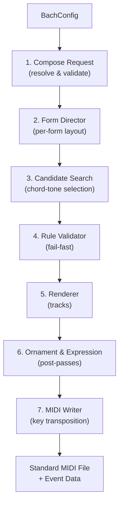
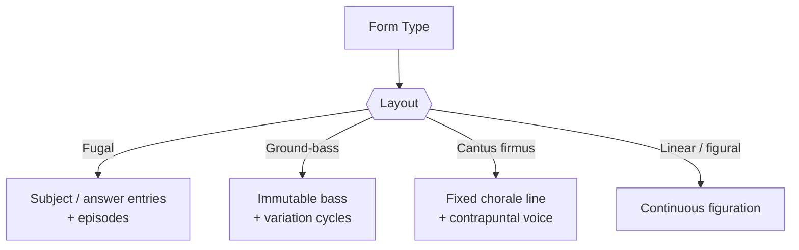

# Generation Pipeline

When you call `generator.generate(config)`, the composer engine runs a fixed pipeline that turns the request into a complete, deterministic composition.

::: info Musical vocabulary in this pipeline
The pipeline treats music as structured data: forms allocate voices, harmony supplies chord targets, candidate search chooses notes, and validation rejects illegal voice interactions. The compact glossary is in [Music Primer for Engineers](/docs/music-primer).
:::


```mermaid
graph TD
    A["BachConfig"] --> B["1. Compose Request<br>(resolve & validate)"]
    B --> C["2. Form Director<br>(per-form layout)"]
    C --> D["3. Candidate Search<br>(chord-tone selection)"]
    D --> E["4. Rule Validator<br>(fail-fast)"]
    E --> F["5. Renderer<br>(tracks)"]
    F --> G["6. Ornament & Expression<br>(post-passes)"]
    G --> H["7. MIDI Writer<br>(key transposition)"]
    H --> I["Standard MIDI File<br>+ Event Data"]
```

The whole pipeline is deterministic: the same config and seed always yield byte-identical output.

## Step 1: Compose Request

The raw config is resolved into a compose request. Defaults are filled in, the seed is resolved (a `seed` of `0` becomes a concrete non-zero value, reported via `getInfo().seedUsed`), and the request is validated.

Validation is strict: unknown `form`/`character`/`instrument`/`scale` values and out-of-range `bpm` are rejected, as are forbidden character/form pairs (`chorale_prelude` rejects `playful`/`restless`; `toccata_and_fugue` rejects `noble`). The `form` fixes the voice count, meter, and natural length; `scale`/`targetBars` resolve the final bar count (snapped to the form's granularity and clamped to `[min, 128]`).

## Step 2: Form Director

The form director lays out the piece. For the chosen form it assigns **voice intents** to bar spans — subjects and answers, ground basses, cantus firmus, figuration, variation material — across the resolved length.

::: info Bar span and material
A **bar span** is a range of measures. **Material** is predeclared musical content, such as a fugue subject or repeating ground bass, that the candidate search should respect instead of freely replacing.
:::


```mermaid
graph TD
    A["Form Type"] --> B{{"Layout"}}
    B -->|"Fugal"| C["Subject / answer entries<br>+ episodes"]
    B -->|"Ground-bass"| D["Immutable bass<br>+ variation cycles"]
    B -->|"Cantus firmus"| E["Fixed chorale line<br>+ contrapuntal voice"]
    B -->|"Linear / figural"| F["Continuous figuration"]
```

The layout follows a **design-value arc** — establish, develop, climax at roughly 80% of the span, then resolve — that drives the density, register, and velocity tiers used downstream. The arc is fixed by the form, not searched.

## Step 3: Candidate Search

Against a harmonic plan (chords, modulation, cadences), the candidate search selects notes for each non-fixed voice. Selection is **per-beat and chord-tone anchored**: at each beat the search prefers pitches that are consonant with the harmony and with the other voices, falling back through ranked alternatives when the first choice violates a constraint. Material assigned by the form director (subjects, grounds, cantus firmus) is fixed and is not re-selected here.

::: info Chords, modulation, cadences
**Chords** are the vertical targets at each point in time. **Modulation** means moving the tonal center to another key. A **cadence** is a phrase ending, usually a dominant-to-tonic arrival such as V to I.
:::

## Step 4: Rule Validator

The validator checks the assembled voices against counterpoint and structure rules and fails fast on a violation. It reports failures with rule identifiers so the responsible span can be located. Learn the musical ideas in [Counterpoint Course](/docs/counterpoint), then use the [Validator Rule Reference](/docs/validator-rules) when you need to look up a specific rule ID.

::: info What fail-fast means here
The engine does not keep a list of every possible musical problem in a bad candidate. It stops at the first violated rule for that pass, reports the rule identifier, and lets the search or caller handle the failed candidate.
:::

## Step 5: Renderer

The validated voices are rendered into tracks — one track per voice — with channels, the instrument's General MIDI program, and note timings.

::: info Source tags survive rendering
Rendered notes keep their provenance: `"material"` for fixed source material, `"compose"` for notes selected by candidate search, and `"ornament"` for notes added later. This is useful when debugging why a rule could or could not rewrite a note.
:::

## Step 6: Ornament & Expression (post-pass)

Deterministic post-passes decorate the rendered tracks. At the C++ library level the ornament pass is a separate function (`applyOrnamentPass`) deliberately kept out of `Composer::run()`; the public generation path `bach_generate_from_json` — used by the JS API, CLI, and this demo — always invokes it after validation.

- **Ornaments** — trills, mordents, and Nachschlag, with density depending on character and instrument. Ground-bass and cantus-firmus lines are never ornamented.
- **Expression** — organ registration as a CC#7/#11 curve following the form's energy arc, and closing ritardando tempo events.

Notes added by these passes carry the `source: "ornament"` provenance tag (versus `"material"` and `"compose"`).

::: info Ornament
An **ornament** is a small decorative figure added around a structural note. It is not the source melody itself, so event data marks it separately with `source: "ornament"`.
:::

## Step 7: MIDI Writer

The internal representation is composed entirely in C. The MIDI writer is the **only** place where the requested `key` is applied — pitches are transposed on the way out, time signatures are written (3/4 for passacaglia and chaconne, 4/4 otherwise), and the result is a Type 1 Standard MIDI File.

```js
const midi = generator.getMidi()       // Uint8Array (transposed to your key)
const events = generator.getEvents()   // Event data (pitches stay in C)
```

::: tip
The events JSON from `getEvents()` reports pitches in C and tags every note with its `source`. See the [JavaScript API](/docs/api-js#eventdata) for the full type definitions.
:::
