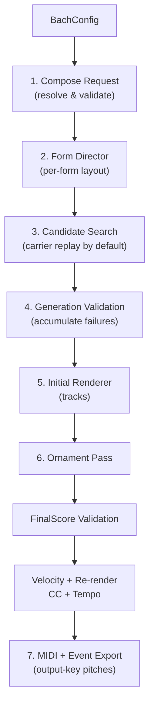
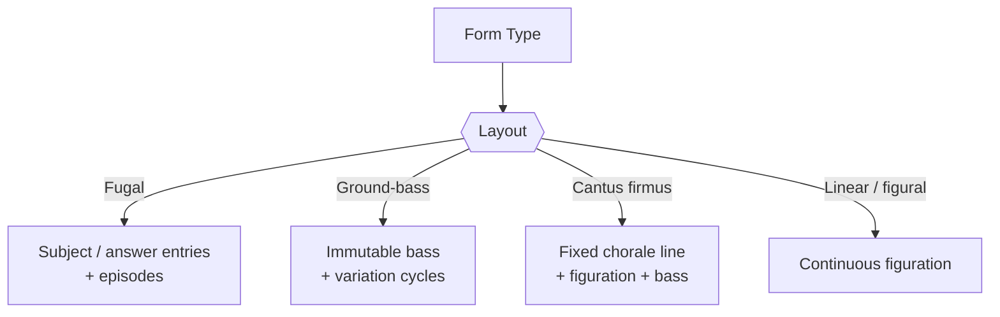

# Generation Pipeline

When you call `generator.generate(config)`, the composer engine runs a fixed pipeline that turns the request into a complete, deterministic composition.

::: info Musical vocabulary in this pipeline
The pipeline treats music as structured data: forms allocate voices and authored note carriers, harmony supplies chord targets, and validation rejects illegal voice interactions. The compact glossary is in [Music Primer for Engineers](/docs/music-primer).
:::


```mermaid
graph TD
    A["BachConfig"] --> B["1. Compose Request<br>(resolve & validate)"]
    B --> C["2. Form Director<br>(per-form layout)"]
    C --> D["3. Candidate Search<br>(carrier replay by default)"]
    D --> E["4. Generation Validation<br>(accumulate failures)"]
    E --> F["5. Initial Renderer<br>(tracks)"]
    F --> G["6. Ornament Pass"]
    G --> H["FinalScore Validation"]
    H --> I["Velocity + Re-render<br>CC + Tempo"]
    I --> J["7. MIDI + Event Export<br>(output-key pitches)"]
```

The whole pipeline is deterministic: the same config and seed always yield byte-identical output.

## Step 1: Compose Request

The raw config is resolved into a compose request. Defaults are filled in, the seed is resolved (a `seed` of `0` becomes a concrete non-zero value, reported via `getInfo().seedUsed`), and the request is validated.

Validation is strict: unknown `form`/`character`/`instrument`/`scale` values and out-of-range `bpm` are rejected, as are forbidden character/form pairs (`chorale_prelude` rejects `playful`/`restless`; `toccata_and_fugue` rejects `noble`). The `form` fixes the voice count, meter, and natural length; `scale`/`targetBars` resolve the final bar count (snapped to the form's granularity and clamped to `[min, 128]`).

## Step 2: Form Director

The form director lays out the piece. For the chosen form it assigns **voice intents** to bar spans — subjects and answers, ground basses, cantus firmus, figuration, variation material — across the resolved length.

::: info Bar span and material
A **bar span** is a range of measures. **Material** is authored musical content, such as a fugue subject, a counterline, or a repeating ground bass, that a carrier replays verbatim.
:::


```mermaid
graph TD
    A["Form Type"] --> B{{"Layout"}}
    B -->|"Fugal"| C["Subject / answer entries<br>+ episodes"]
    B -->|"Ground-bass"| D["Immutable bass<br>+ variation cycles"]
    B -->|"Cantus firmus"| E["Fixed chorale line<br>+ figuration + bass"]
    B -->|"Linear / figural"| F["Continuous figuration"]
```

The layout follows a **design-value arc** — establish, develop, climax at roughly 80% of the span, then resolve — that drives the density, register, and velocity tiers used downstream. The arc is fixed by the form, not searched.

## Step 3: Candidate Search

Candidate search dispatches every voice-intent span. In all default shipped forms, those spans are carriers: they replay the notes assembled by the form builder verbatim. This carrier-assembly path produces every default note; the scored search branch contributes zero.

The scored branch is an off-by-default diagnostic option. `bach_cli --free-counterpoint` reroutes only the Passacaglia V1 (`voice == 1`) counterline to per-beat, chord-tone-anchored search. The ground and principal variation remain carriers. No other form has an eligible span, so requesting free counterpoint for another form returns `FreeCounterpointUnavailable`.

::: info Chords, modulation, cadences
**Chords** are the vertical targets at each point in time. **Modulation** means moving the tonal center to another key. A **cadence** is a phrase ending, usually a dominant-to-tonic arrival such as V to I.
:::

## Step 4: Rule Validator

The validator checks the assembled voices against counterpoint and structure rules. It accumulates the failures found during the pass and reports each with a rule identifier so the responsible span can be located. Learn the musical ideas in [Counterpoint Course](/docs/counterpoint), then use the [Validator Rule Reference](/docs/validator-rules) when you need to look up a specific rule ID.

::: info What happens after a blocking failure
The public generation path aborts and returns the validation report. It does not repair the score, retry the search, or choose a different candidate.
:::

## Step 5: Renderer

As the final part of `Composer::run()`, the assembled voices are rendered into tracks — one track per voice — with channels and note timings. After final validation, the public generation path applies the instrument-specific velocity curve and renders the tracks again with the General MIDI program.

::: info Source tags survive rendering
Rendered notes keep their provenance: `"material"` for carrier material, `"compose"` for notes from the opt-in scored search, and `"ornament"` for notes added later. This is useful when locating the source of a validation finding.
:::

## Step 6: Ornament & Expression (post-pass)

The public generation path runs these operations in order after `Composer::run()`: apply ornaments, run `FinalScore` validation, apply the velocity curve and re-render, add controller events, then add tempo events. A blocking `FinalScore` failure aborts before velocity, controller, tempo, MIDI, or public event output.

- **Ornaments** — trills, mordents, and Nachschlag, with density depending on character and instrument. Ground-bass and cantus-firmus lines are never ornamented.
- **Velocity** — an instrument-aware phrase curve applied after final validation; the tracks are re-rendered so MIDI and `getEvents()` expose the updated values.
- **Expression** — CC 7 registration terraces for organ and harpsichord; CC 11 continuous expression for piano, violin, and cello.
- **Tempo** — a form-dependent closing ritardando (none for the Trio Sonata) and, for the prelude, toccata, and fantasia forms, a section tempo change at the fugue entry.

Notes added by these passes carry the `source: "ornament"` provenance tag (versus `"material"` and `"compose"`).

::: info Ornament
An **ornament** is a small decorative figure added around a structural note. It is not the source melody itself, so event data marks it separately with `source: "ornament"`.
:::

## Step 7: MIDI Writer

The internal representation is composed and validated in C. The output writers apply the requested `key` and any output-octave shift. The MIDI writer also writes time signatures (3/4 for passacaglia and chaconne, 4/4 otherwise) and produces a Type 1 Standard MIDI File. The public event writer applies the same pitch transformation.

```js
const midi = generator.getMidi()       // Uint8Array (transposed to your key)
const events = generator.getEvents()   // Event data (pitches in the output key)
```

::: tip
`getEvents()` reports output-key pitches and tags every note with its `source`. The lower-level `generated.v1` diagnostic artifact keeps internal C pitches. See the [JavaScript API](/docs/api-js#eventdata) for the public event type definitions.
:::

## Beyond the pipeline: how quality is measured

The seven steps above are everything that happens at runtime. By default, the pipeline never searches for a "more Bach-like" candidate while generating: the form builder authors the carrier material, and the validator rejects illegal results. So how do we know those design values actually produce Bach-like output?

The answer is **development-side quality gates**. Whenever a form or figuration in the engine changes, the generated output is run through two families of automated checks. Both ship as public Python tooling in the engine repository (the `texture-gate` and `closure` commands of `bach_tools.py`).

### The corpus statistics model

Five distributions are extracted from a generated piece's event data and scored by their distance (negative log-likelihood) from reference distributions estimated over a corpus of real works. A distance beyond a calibrated threshold fails the gate.

| Feature | What it captures |
|---------|------------------|
| Pitch class | How often each note name is used |
| Melodic interval | The distribution of distances between adjacent notes within a voice |
| Duration | The distribution of note lengths |
| Beat position | Where in the bar notes are attacked |
| Vertical interval class | The distribution of intervals between simultaneously sounding notes |

The most heavily weighted of these is the **melodic interval**. In Bach's actual writing the dominant melodic interval is overwhelmingly the **step** (a move of one or two semitones to a neighboring scale tone — see the [primer](/docs/music-primer#steps-and-leaps)), so a leap-heavy line widens this distance immediately.

### The tension between horizontal steps and vertical consonance

This is where the core tension of figuration design lives.

- **Horizontally**: a line matches the corpus better the more stepwise it is — scalar runs, wave figures.
- **Vertically**: beat onsets sound consonant against a sustained bass the more they are anchored to the bar's chord tones (see also [Leaps need recovery](/docs/counterpoint/melody)).

Implemented naively, the two collide: a freely running scale line steps onto non-chord tones at beat onsets, while jumping every beat to the nearest chord tone produces a leap-riddled line. The engine's figures (scalar wave, sawtooth, broken chord) are written to keep both — landing on chord tones that lie *ahead in the running direction*, and choosing oscillation partners from bass-consonant neighbor tones before resorting to a leap.

### Texture gates

Alongside the statistics model, a seed × form sweep checks structural metrics directly — per-voice activity, silence ratios, repeated-note run lengths, parallel perfect intervals, and the model score threshold above. If a single case fails, the change does not merge.

::: info These are not part of generate()
Neither the corpus model nor the texture gates run at runtime. Generation is always a deterministic single shot; quality is guaranteed on the side that produces it — in the design values, at development time.
:::
