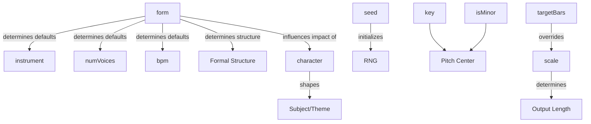
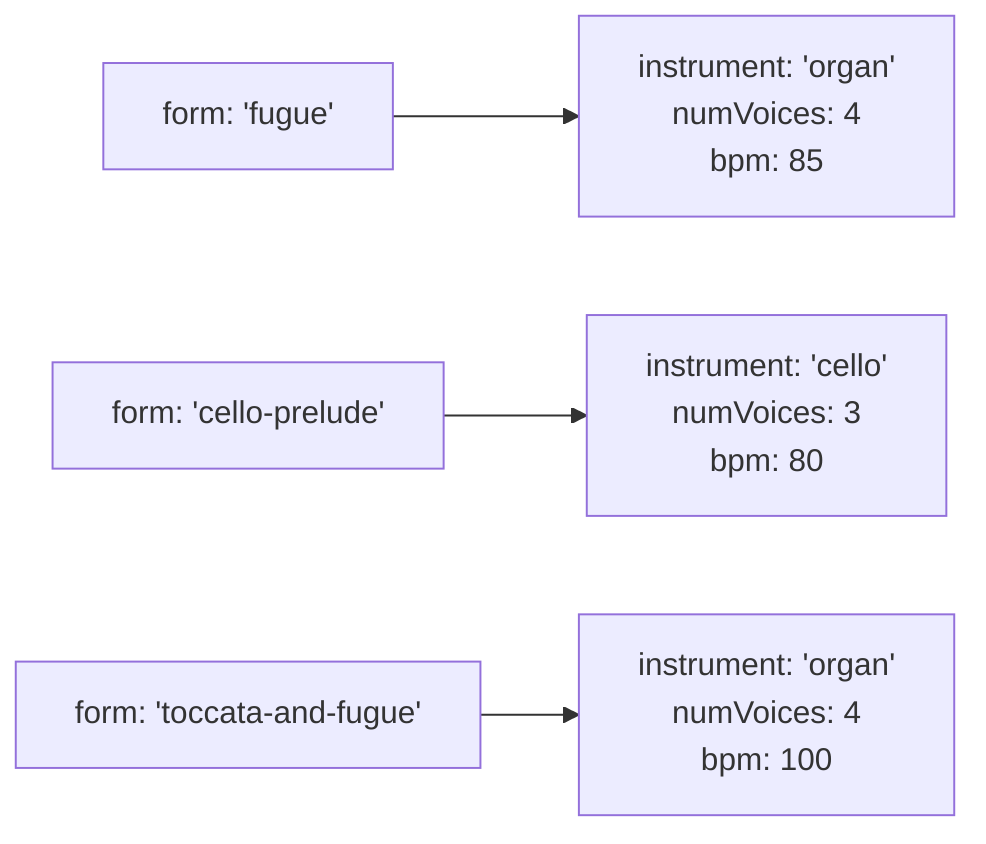

# Option Relationships

MIDI Sketch Bach's configuration options interact with each other in specific ways. Understanding these relationships helps you craft configurations that produce the results you want.

## Dependency Overview



## Form Determines Defaults

The `form` parameter is the most influential configuration option. It determines the default values for `instrument`, `numVoices`, and `bpm`.



### Default Cascade

When you specify a form, defaults are applied for any unspecified fields:

```js
// You specify:
generator.generate({ form: 'fugue', key: 2, isMinor: true })

// Engine resolves to:
// {
//   form: 0,
//   key: 2,
//   isMinor: true,
//   instrument: 0,    ← form default (organ)
//   numVoices: 4,     ← form default
//   bpm: 85,          ← form default
//   seed: 0,          ← random
//   character: 0,     ← balanced
//   scale: 1,         ← medium
// }
```

Any field you explicitly set overrides the form default:

```js
// Override instrument and BPM
generator.generate({
  form: 'fugue',
  instrument: 'harpsichord',  // overrides organ
  bpm: 72                     // overrides 85
})
```

See the [Presets Reference](/docs/presets) for the complete default table.

## Voice Count Constraints

The `numVoices` parameter has valid ranges that depend on the form:

| Form | Default | Minimum | Maximum | Notes |
|------|---------|---------|---------|-------|
| 0: Fugue | 4 | 2 | 5 | |
| 1: Prelude and Fugue | 4 | 2 | 5 | |
| 2: Trio Sonata | 3 | 3 | 3 | Fixed at 3 |
| 3: Chorale Prelude | 4 | 3 | 5 | Needs at least 3 for cantus + 2 accompaniment |
| 4: Toccata and Fugue | 4 | 3 | 5 | |
| 5: Passacaglia | 4 | 3 | 5 | |
| 6: Fantasia and Fugue | 4 | 3 | 5 | |
| 7: Cello Prelude | 3 | 2 | 3 | Solo instrument implied voices |
| 8: Chaconne | 3 | 2 | 4 | Solo instrument implied voices |

::: warning
Setting `numVoices` outside the valid range for a form may cause the engine to clamp to the nearest valid value. For example, requesting 5 voices for a Trio Sonata will still produce 3 voices.
:::

## Scale vs. targetBars

The `scale` and `targetBars` parameters both control output length, but they interact:

| Configuration | Behavior |
|--------------|----------|
| `scale` only | Output length determined by scale level and form |
| `targetBars` only | Engine aims for the specified bar count |
| Both specified | `targetBars` overrides `scale` |
| Neither specified | Default: `scale: 1` (medium) |

::: tip
Use `scale` when you want a general size category (short, medium, long, full). Use `targetBars` when you need a specific length. The actual output may differ slightly from `targetBars` because musical phrases need to end at natural boundaries.
:::

```js
// General length control
generator.generate({ form: 'fugue', scale: 'long' })

// Specific length control
generator.generate({ form: 'fugue', targetBars: 48 })

// targetBars wins when both specified
generator.generate({
  form: 'fugue',
  scale: 'short',      // ignored
  targetBars: 48        // this is used
})
```

## Seed Behavior

The `seed` parameter controls deterministic output:

| Seed Value | Behavior |
|-----------|----------|
| `0` (default) | Random seed — different output each time |
| Any positive integer | Deterministic — same config + same seed = same output |

::: warning Reproducibility
Deterministic reproduction requires the same version of MIDI Sketch Bach. The internal algorithms may change between versions, so the same seed may produce different output after an upgrade. If you need to preserve specific outputs, save the generated MIDI files rather than relying on seed reproducibility across versions.
:::

```js
// Random each time
generator.generate({ form: 'fugue', seed: 0 })

// Always produces the same result
generator.generate({ form: 'fugue', key: 2, isMinor: true, seed: 42 })

// Different key = different output even with same seed
generator.generate({ form: 'fugue', key: 0, isMinor: true, seed: 42 })
```

## Key and Mode

The `key` and `isMinor` parameters work together to define the tonal center:

```js
// D major
generator.generate({ key: 2, isMinor: false })

// D minor
generator.generate({ key: 2, isMinor: true })
```

| Parameter | Range | Default |
|-----------|-------|---------|
| `key` | 0--11 (pitch class) | 0 (C) |
| `isMinor` | `true` / `false` | `false` (major) |

The key affects:
- The pitch center and scale of the composition
- The harmonic vocabulary available to the engine
- Modulation targets (related keys)

## Character and Form

The `character` parameter's impact varies by form type:

| Form Type | Character Impact |
|-----------|-----------------|
| Fugal forms (0, 1, 4, 6) | **Strong** — directly shapes the fugue subject, which defines the entire piece |
| Variation forms (5, 8) | **Moderate** — influences the bass theme and variation character |
| Chorale Prelude (3) | **Moderate** — affects the accompanying voices, cantus firmus is fixed |
| Trio Sonata (2) | **Moderate** — shapes the motivic material for both upper voices |
| Cello Prelude (7) | **Moderate** — influences figuration patterns |

::: tip
Character 0 (balanced) is a good default for most situations. Try character 3 (dramatic) for Toccata and Fugue, or character 1 (lyrical) for Chorale Prelude.
:::

## Validation Rules

Complete validation constraints for all configuration fields:

| Field | Type | Range | Default | Validation |
|-------|------|-------|---------|------------|
| `form` | number or string | 0--8 | 0 | Clamped to valid range |
| `key` | number | 0--11 | 0 | Clamped to valid range |
| `isMinor` | boolean | true/false | false | -- |
| `numVoices` | number | Form-dependent (2--5) | Form default | Clamped to form's valid range |
| `bpm` | number | 40--200 | Form default | 0 uses form default; clamped otherwise |
| `seed` | number | 0+ | 0 | 0 = random |
| `character` | number or string | 0--3 | 0 | Clamped to valid range |
| `instrument` | number or string | 0--5 | Form default | Clamped to valid range |
| `scale` | number or string | 0--3 | 1 | Clamped to valid range |
| `targetBars` | number | 1+ | -- | Overrides scale when specified |
