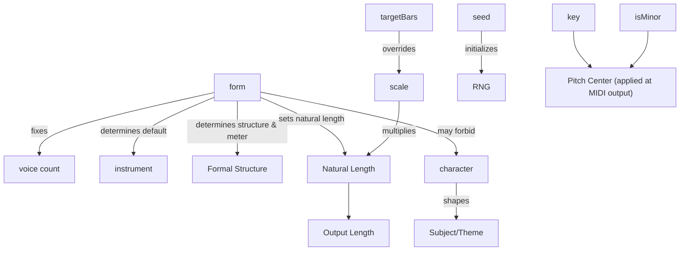
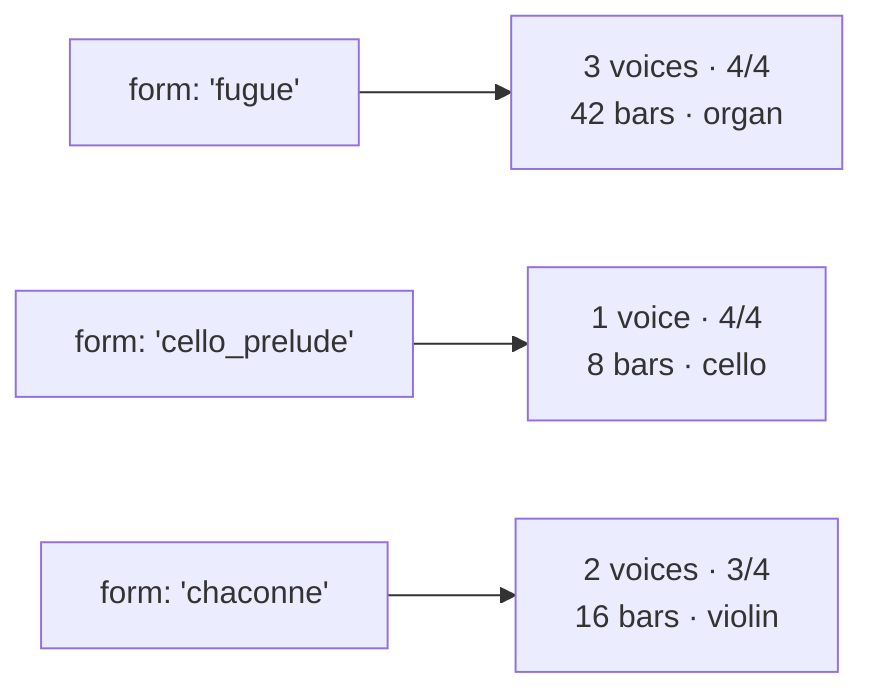

# Option Relationships

MIDI Sketch Bach's configuration options interact with each other in specific ways. Understanding these relationships helps you craft configurations that produce the results you want.

::: info Two layers of options
Some options choose musical structure (`form`, `key`, `isMinor`, `character`), while others choose rendering or reproducibility (`instrument`, `bpm`, `seed`). The [Music Primer for Engineers](/docs/music-primer) explains the musical terms used here.
:::

## Dependency Overview


```mermaid
graph TD
    A["form"] -->|"fixes"| C["voice count"]
    A -->|"determines default"| B["instrument"]
    A -->|"determines structure & meter"| E["Formal Structure"]
    A -->|"sets natural length"| P["Natural Length"]
    F["scale"] -->|"multiplies"| P
    P --> G["Output Length"]
    H["targetBars"] -->|"overrides"| F
    I["seed"] -->|"initializes"| J["RNG"]
    K["key"] --> L["Pitch Center (applied at MIDI output)"]
    M["isMinor"] --> L
    N["character"] -->|"shapes"| O["Subject/Theme"]
    A -->|"may forbid"| N
```

## Form Decides the Voice Count

The `form` is the most influential option. It **fixes** the number of voices, the meter, and the natural length, and it selects the default `instrument`.


```mermaid
graph LR
    A["form: 'fugue'"] --> B["3 voices · 4/4<br>42 bars · organ"]
    C["form: 'cello_prelude'"] --> D["1 voice · 4/4<br>8 bars · cello"]
    E["form: 'chaconne'"] --> F["2 voices · 3/4<br>16 bars · violin"]
```

::: warning `numVoices` was removed
There is no voice-count option anymore — pick the form to pick the texture (see the [Forms](/docs/forms) table). Passing `num_voices`/`numVoices` is accepted and ignored for backward compatibility; it never errors and has no effect.
:::

### Default Cascade

When you specify a form, the engine fills in unspecified fields:

```js
// You specify:
generator.generate({ form: 'fugue', key: 2, isMinor: true })

// Engine resolves to:
// {
//   form: 'fugue',
//   key: 2,
//   isMinor: true,
//   instrument: 'organ',  ← form default
//   bpm: 100,             ← default
//   seed: 0,              ← random (resolved seed in getInfo().seedUsed)
//   character: 'severe',  ← default
//   scale: 'short',       ← default (≈ natural length)
// }
// Voice count (3), meter (4/4), and natural length (42 bars) come from the form.
```

Any field you explicitly set overrides the default:

```js
// Override instrument and BPM
generator.generate({
  form: 'fugue',
  instrument: 'harpsichord',  // overrides organ
  bpm: 72                     // overrides default 100
})
```

See the [Forms](/docs/forms) table for per-form voice counts and the [Presets Reference](/docs/presets) for the full default table.

## Instrument Defaults

Each form selects a default instrument, but any instrument may be substituted:

| Form | Default Instrument |
|------|--------------------|
| `fugue`, `prelude_and_fugue`, `trio_sonata`, `chorale_prelude`, `toccata_and_fugue`, `passacaglia`, `fantasia_and_fugue` | Organ |
| `cello_prelude` | Cello |
| `chaconne` | Violin |
| `goldberg_variations` | Harpsichord |

The `instrument` choice affects the General MIDI program, the playable range used during generation, and the ornament density of the post-pass. An invalid instrument string throws.

## Scale and targetBars

`scale` and `targetBars` both set the output length. `scale` is a multiplier of the form's natural length; `targetBars` is an explicit override.

| Configuration | Behavior |
|--------------|----------|
| `scale` only | Length = form's natural length × the scale multiplier |
| `targetBars` only | Engine targets that bar count |
| Both specified | `targetBars` wins; `scale` is ignored |
| Neither specified | Default: `scale: "short"` (≈ natural length) |

The scale multipliers are approximately `short` ≈ 1x, `medium` ≈ 2x, `long` ≈ 3x, `full` ≈ 4x of the form's natural length.

::: warning CLI difference
The CLI falls back to `--scale medium` for fugue when `--scale` is omitted — a CLI-only convenience. The JS API default is always `scale: "short"` regardless of form. See the [CLI reference](/docs/cli).
:::

::: tip
`targetBars` is snapped to the form's granularity (e.g. the ground-bass period) and clamped to `[form minimum, 128]`. Every form caps at 128 bars. Use `scale` for a general size category; use `targetBars` for a specific length.
:::

```js
// Length as a multiple of the form's natural length
generator.generate({ form: 'fugue', scale: 'long' })   // ≈ 3 × 42 bars

// Specific length (snapped and clamped)
generator.generate({ form: 'fugue', targetBars: 48 })

// targetBars wins when both specified
generator.generate({
  form: 'fugue',
  scale: 'short',      // ignored
  targetBars: 48        // this is used
})
```

## Seed Behavior

The `seed` parameter controls deterministic output:

| Seed Value | Behavior |
|-----------|----------|
| `0` (default) | A random non-zero seed is chosen; the resolved value is reported via `getInfo().seedUsed` |
| Any positive integer | Deterministic — same config + same seed = byte-identical output |

::: tip Reproducing a random run
After a `seed: 0` run, read `getInfo().seedUsed` and pass it back as `seed` to regenerate the exact same piece.
:::

::: warning Reproducibility
Deterministic reproduction requires the same version of MIDI Sketch Bach. The internal algorithms may change between versions, so the same seed may produce different output after an upgrade. If you need to preserve specific outputs, save the generated MIDI files rather than relying on seed reproducibility across versions.
:::

```js
// Random each time
generator.generate({ form: 'fugue', seed: 0 })

// Always produces the same result
generator.generate({ form: 'fugue', key: 2, isMinor: true, seed: 42 })

// Different key = different output even with same seed
generator.generate({ form: 'fugue', key: 0, isMinor: true, seed: 42 })
```

## Key and Mode

The `key` and `isMinor` parameters work together to define the tonal center:

::: info Tonal center
The **tonal center** is the pitch that feels like home. `key` chooses the pitch class, and `isMinor` chooses whether the surrounding mode is major or minor.
:::

```js
// D major
generator.generate({ key: 2, isMinor: false })

// D minor
generator.generate({ key: 2, isMinor: true })
```

| Parameter | Range | Default |
|-----------|-------|---------|
| `key` | 0--11 (pitch class) | 0 (C) |
| `isMinor` | `true` / `false` | `false` (major) |

The key affects:
- The pitch center and scale of the composition
- The harmonic vocabulary available to the engine
- Modulation targets (related keys)

## Character and Form

The `character` parameter (`severe`, `playful`, `noble`, `restless`) shapes the primary thematic material. Its impact varies by form, and some combinations are forbidden:

::: info Character is not genre
`character` changes the melodic profile of the subject or primary material: interval size, rhythmic energy, chromatic tendency, and contour. It does not switch the form. A `restless` fugue is still a fugue.
:::

| Form Type | Character Impact |
|-----------|-----------------|
| Fugal forms (`fugue`, `prelude_and_fugue`, `toccata_and_fugue`, `fantasia_and_fugue`) | **Strong** — directly shapes the fugue subject, which defines the entire piece |
| Variation forms (`passacaglia`, `chaconne`, `goldberg_variations`) | **Moderate** — colours the variations over the fixed bass |
| Chorale Prelude | **Moderate** — affects the contrapuntal voice; cantus firmus is fixed |
| Trio Sonata | **Moderate** — shapes the motivic material for the upper voices |
| Cello Prelude | **Moderate** — influences figuration patterns |

::: warning Forbidden character/form pairs (these throw)
- `chorale_prelude` rejects `playful` and `restless`.
- `toccata_and_fugue` rejects `noble`.

Requesting a forbidden pair throws instead of silently substituting a character.
:::

::: tip
`severe` is a solid default for most situations. Try `restless` for Toccata and Fugue, or `noble` for Chorale Prelude.
:::

## Validation Rules

Complete validation constraints for all configuration fields. Note that several fields now **throw** on invalid input rather than clamping:

::: info Config validation vs musical validation
This table covers API/config validation: whether option values are accepted. Counterpoint and form-structure failures are separate musical validator rules; see [Validator Rule Reference](/docs/validator-rules).
:::

| Field | Type | Range | Default | Validation |
|-------|------|-------|---------|------------|
| `form` | number or string | 0--9 / name | `"fugue"` | Unknown name / out-of-range number throws |
| `key` | number | 0--11 | 0 | Out of range throws |
| `isMinor` | boolean | true/false | false | -- |
| `bpm` | number | 0 or 40--200 | 100 | 0 uses default 100; any other out-of-range value throws |
| `seed` | number | 0+ | 0 | 0 = random; resolved value in `getInfo().seedUsed` |
| `character` | string or number | name / 0--3 | `"severe"` | Unknown value throws; forbidden form pairs throw |
| `instrument` | string or number | name / 0--5 | Form default | Unknown value throws |
| `scale` | string or number | name / 0--3 | `"short"` | Unknown value throws |
| `targetBars` | number | >0 | -- | Overrides scale; snapped to form granularity, clamped to `[min, 128]` |
| `numVoices` | number | -- | -- | Accepted and ignored (form decides voices) |
