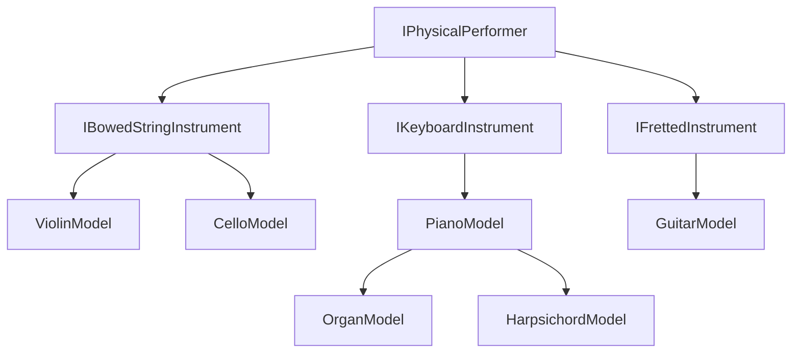
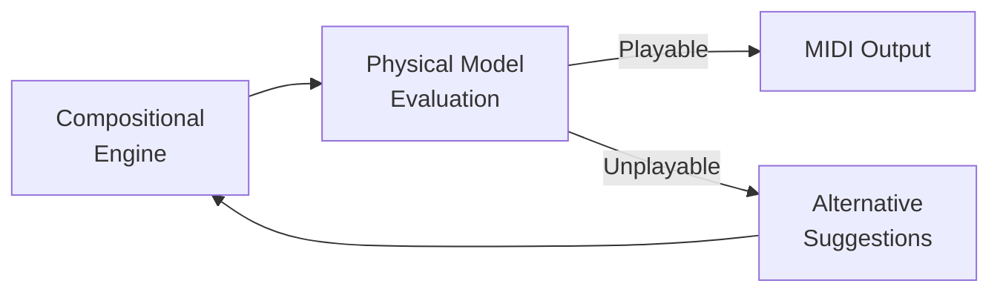

# Physical Instrument Models

MIDI Sketch Bach includes physical models for six instruments. These models evaluate whether generated notes are physically performable on modern instruments and guide the generation engine toward idiomatic, comfortable passages.

::: info Design Principle
The physical performer model does **not** generate music — it evaluates whether generated music is physically realizable. This separation keeps the compositional logic independent from instrument-specific constraints.
:::

## Overview

Every instrument model implements a common interface (`IPhysicalPerformer`) that provides:

| Method | Purpose |
|--------|---------|
| `canPerform(pitch, start, duration)` | Boolean feasibility check |
| `calculateCost(pitch, start, duration, state)` | Ergonomic difficulty score (0.0 = effortless, higher = harder) |
| `suggestAlternatives(pitch, ...)` | Sorted list of alternative pitches when the desired pitch is unplayable |
| `updateState(state, pitch, start, duration)` | Track performer state (hand position, fatigue, bow direction, etc.) |

The cost-based approach allows the generation pipeline to choose the most natural option among multiple valid possibilities, rather than simply accepting or rejecting pitches.

## Instrument Categories

## Bowed String Instruments

### Violin

| Property | Value |
|----------|-------|
| Tuning | G3, D4, A4, E5 (MIDI 55, 62, 69, 76) |
| Range | G3–C7 (MIDI 55–96) |
| Strings | 4 |

The violin model accounts for:

- **Position shifts** — Cost increases with distance; high positions (5th+) incur additional penalty (`kHighPositionCost = 0.15`)
- **String crossings** — Penalty per string crossed (`kStringCrossCostPerString = 0.08`)
- **Double stops** — Feasible only on adjacent strings
- **Chord arpeggiation** — Required for 3+ note chords (bow cannot sustain 3 strings simultaneously)
- **Bariolage** — Supported, especially on E and A strings

### Cello

| Property | Value |
|----------|-------|
| Tuning | C2, G2, D3, A3 (MIDI 36, 43, 50, 57) |
| Range | C2–A5 (MIDI 36–81) |
| Strings | 4 |

The cello model shares the violin's bowed string mechanics but with important differences:

- **Higher shift costs** — Longer string length makes position shifts more costly (`kShiftCostPerPosition = 0.15` vs. violin's `0.1`)
- **Thumb position** — Required above certain pitches on each string, adding significant cost (`kThumbPositionCost = 0.3`)
- **Extended upper range** — The A string can reach up to 24 semitones above open (via thumb position)

### Bowed String Features

#### Bow Direction

Bow directions are automatically assigned following traditional performance practice:

- **Down bow** on bar starts (strong beats)
- **Up/down alternation** on subsequent notes
- **Natural** (performer's choice) when crossing 3+ strings
- **Sustained direction** for slurred groups (consecutive stepwise motion)

#### Natural Harmonics

The engine detects and marks natural harmonics at two positions:

| Harmonic | String Division | Interval Above Open |
|----------|----------------|-------------------|
| Octave | 1/2 length | +12 semitones |
| Fifth | 1/3 length | +19 semitones |

Harmonics are reserved for climactic moments (peak arc phase) and require sufficient note duration.

## Keyboard Instruments

### Piano

| Property | Value |
|----------|-------|
| Range | A0–C8 (MIDI 21–108) |
| Velocity Sensitive | Yes |

The piano model evaluates hand assignment and playability with configurable skill levels:

| Skill Level | Normal Span | Max Span | Max Notes per Hand |
|-------------|-------------|----------|--------------------|
| Beginner | 7 semitones | 9 semitones | 4 |
| Intermediate | 9 semitones | 11 semitones | 5 |
| Advanced | 10 semitones | 12 semitones | 5 |
| Virtuoso | 12 semitones | 14 semitones | 5 |

Key capabilities:

- **Hand assignment** — Automatically allocates pitches to left/right hands
- **Transition cost** — Evaluates jumps, stretches, crossovers, and repeated notes
- **Fatigue tracking** — Models hand fatigue over sustained passages

### Organ

| Property | Value |
|----------|-------|
| Manuals | Great (I), Swell (II), Positiv (III), Pedal |
| Velocity Sensitive | No (fixed velocity 80) |

The organ model extends the piano model with multi-manual and pedalboard support:

| Manual | Range | MIDI Channel | GM Program |
|--------|-------|-------------|------------|
| Great | C2–C6 (MIDI 36–96) | 0 | 19 (Church Organ) |
| Swell | C2–C6 (MIDI 36–96) | 1 | 20 (Reed Organ) |
| Positiv | C3–C6 (MIDI 48–96) | 2 | 19 (Church Organ) |
| Pedal | C1–D3 (MIDI 24–50) | 3 | 19 (Church Organ) |

- Organists are assumed to be at virtuoso skill level
- Pedal notes outside the ideal range incur a steep penalty (5.0 per semitone)

### Harpsichord

| Property | Value |
|----------|-------|
| Range | F1–F6 (MIDI 29–89) |
| Manuals | 2 (Lower, Upper) |
| Velocity Sensitive | No (plucked mechanism, fixed velocity 80) |

- Uses advanced-level span constraints
- Narrower range than modern piano

## Fretted Instruments

### Guitar

| Property | Value |
|----------|-------|
| Tuning | E2, A2, D3, G3, B3, E4 (MIDI 40, 45, 50, 55, 59, 64) |
| Range | E2–B5 (MIDI 40–83) |
| Strings | 6 |
| Frets | 19 |

The guitar model evaluates fret positions and ergonomic transition costs:

| Cost Component | Description | Base Cost |
|---------------|-------------|-----------|
| Stretch | Finger stretch within position (comfortable span: 4 frets) | 0.1 per fret |
| Stretch (beyond span) | Exceeding comfortable 4-fret span | 0.4 + 0.3 per excess fret |
| Position shift | Moving hand to new position | 0.5 + 0.2 per excess fret |
| String crossing | Crossing between strings | 0.05 per string |
| Barré | Index finger laid flat across multiple strings at the same fret | Added to chord cost |

Barré (barre) chords — where the index finger presses multiple strings at the same fret — are a fundamental guitar technique. The model accounts for the additional effort required:

- **Full barré** — All 6 strings pressed at one fret (e.g., F major in 1st position). Higher cost due to sustained finger pressure.
- **Half barré** — 2–3 strings pressed. Lower cost than full barré.
- **Barré + fingered notes** — The remaining fingers fret individual notes above the barré. Cost combines barré pressure with finger stretch.
- **Fret position effect** — Barré near the nut (frets 1–3) requires more force due to higher string tension; higher frets are easier.

## How It Fits in the Pipeline

The physical model layer sits between the compositional engine and the final MIDI output:

The generation pipeline queries the physical model at each step. When a generated note receives a high cost or is deemed unplayable, the engine requests alternatives and selects the most musically appropriate option that remains physically comfortable.

::: tip
See [Voice Architecture](/docs/voice-architecture) for how voices map to instruments, and [Generation Pipeline](/docs/generation-pipeline) for how physical models integrate into the overall generation flow.
:::
