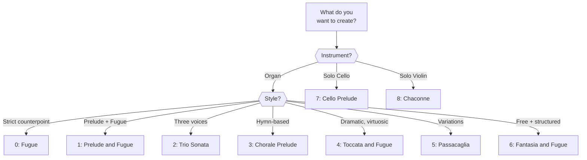

# Presets Reference

Complete reference for all configurable presets in MIDI Sketch Bach.

## Forms Reference

### All 9 Forms

| ID | Name | String | Category | Default Instrument | Default BPM | Default Voices |
|----|------|--------|----------|-------------------|-------------|----------------|
| 0 | Fugue | `"fugue"` | Organ | Organ | 85 | 4 |
| 1 | Prelude and Fugue | `"prelude-and-fugue"` | Organ | Organ | 90 | 4 |
| 2 | Trio Sonata | `"trio-sonata"` | Organ | Organ | 90 | 3 |
| 3 | Chorale Prelude | `"chorale-prelude"` | Organ | Organ | 72 | 4 |
| 4 | Toccata and Fugue | `"toccata-and-fugue"` | Organ | Organ | 100 | 4 |
| 5 | Passacaglia | `"passacaglia"` | Organ | Organ | 76 | 4 |
| 6 | Fantasia and Fugue | `"fantasia-and-fugue"` | Organ | Organ | 88 | 4 |
| 7 | Cello Prelude | `"cello-prelude"` | Solo | Cello | 80 | 3 |
| 8 | Chaconne | `"chaconne"` | Solo | Violin | 76 | 3 |

### Form Selection Flowchart



::: info Organ System (Forms 0--6)
The seven organ forms cover the major genres of Bach's organ repertoire. All default to organ registration and typically use 3--4 voices. These forms feature the most sophisticated counterpoint, as the organ's sustained tones make every voice-leading detail audible.
:::

::: info Solo Instrument System (Forms 7--8)
The two solo forms generate music for unaccompanied string instruments. They use implied polyphony — a single melodic line that suggests multiple simultaneous voices through register shifts, arpeggiation, and chordal writing.
:::

::: details BWV References by Form
| Form | Notable Bach Works |
|------|-------------------|
| Fugue | BWV 578 (G minor "Little" Fugue), BWV 542/2 |
| Prelude and Fugue | BWV 532, 541, 548, 846--893 (Well-Tempered Clavier) |
| Trio Sonata | BWV 525--530 (Six Trio Sonatas) |
| Chorale Prelude | BWV 599--644 (Orgelbüchlein), BWV 651--668 |
| Toccata and Fugue | BWV 565 (D minor), BWV 540 |
| Passacaglia | BWV 582 (C minor) |
| Fantasia and Fugue | BWV 537, 542, 561 |
| Cello Prelude | BWV 1007--1012 (Cello Suites) |
| Chaconne | BWV 1004/5 (Partita No. 2 in D minor) |
:::

## Instruments Reference

| ID | Name | String | GM Program | Sound | Typical Forms |
|----|------|--------|-----------|-------|---------------|
| 0 | Organ | `"organ"` | 19 | Church Organ | All organ forms (0--6) |
| 1 | Harpsichord | `"harpsichord"` | 6 | Harpsichord | Any form |
| 2 | Piano | `"piano"` | 0 | Acoustic Grand Piano | Any form |
| 3 | Violin | `"violin"` | 40 | Violin | Chaconne (8) |
| 4 | Cello | `"cello"` | 42 | Cello | Cello Prelude (7) |
| 5 | Guitar | `"guitar"` | 24 | Nylon Guitar | Solo forms (7--8) |

::: tip
While each form has a default instrument, you can override it with any instrument. For example, a fugue played on harpsichord has a distinctly different character than on organ — the harpsichord's crisp attack makes counterpoint lines more distinct.
:::

## Subject Characters

| ID | Name | String | Effect |
|----|------|--------|--------|
| 0 | Balanced | `"balanced"` | Mix of steps and leaps, moderate rhythm |
| 1 | Lyrical | `"lyrical"` | Predominantly stepwise, smooth contour |
| 2 | Energetic | `"energetic"` | Wider intervals, rhythmic variety |
| 3 | Dramatic | `"dramatic"` | Bold leaps, dotted rhythms, chromatic elements |

::: info
The character parameter affects the melodic profile of the fugue subject or primary thematic material. It has the most noticeable effect on fugal forms (Fugue, Prelude and Fugue, Toccata and Fugue, Fantasia and Fugue), where the subject defines the character of the entire piece.
:::

## Scale Modes

| ID | Name | String | Approximate Effect |
|----|------|--------|--------------------|
| 0 | Short | `"short"` | Compact — fewer variations/episodes |
| 1 | Medium | `"medium"` | Standard length (default) |
| 2 | Long | `"long"` | Extended — more development |
| 3 | Full | `"full"` | Maximum — full formal structure |

::: tip
The actual output length depends on the form. A "short" passacaglia will still be longer than a "short" fugue because the passacaglia form requires a minimum number of variations to be musically coherent. Use `targetBars` for precise length control.
:::

## Key Reference

| ID | Name | Pitch Class | Common Baroque Associations |
|----|------|-------------|---------------------------|
| 0 | C | C | Purity, simplicity, clarity |
| 1 | C# / Db | C# | Devotion, depth |
| 2 | D | D | Triumph, brilliance (D major); passion, drama (D minor) |
| 3 | D# / Eb | Eb | Heroic grandeur, nobility |
| 4 | E | E | Joy, brightness (E major); lament (E minor) |
| 5 | F | F | Pastoral, calm |
| 6 | F# / Gb | F# | Intensity, brilliance |
| 7 | G | G | Grace, simplicity (G major); seriousness (G minor) |
| 8 | G# / Ab | Ab | Solemn, devotional |
| 9 | A | A | Tenderness, elegance (A major); gentle melancholy (A minor) |
| 10 | A# / Bb | Bb | Nobility, warmth |
| 11 | B | B | Hard brilliance (B major); somber weight (B minor) |

::: info Key Associations in Baroque Music
Baroque composers associated specific keys with emotional qualities (*Affektenlehre*). D minor was the key of passion and drama (BWV 565 Toccata and Fugue), while C major represented purity (BWV 846 Prelude). These associations are subjective and vary by era, but they influenced Bach's choice of key for his compositions.
:::

All keys work with both `isMinor: false` (major) and `isMinor: true` (minor).

## Default Mapping

Cross-reference of form defaults:

| Form | Instrument | Voices | BPM | Key |
|------|-----------|--------|-----|-----|
| Fugue | Organ (0) | 4 | 85 | Any |
| Prelude and Fugue | Organ (0) | 4 | 90 | Any |
| Trio Sonata | Organ (0) | 3 | 90 | Any |
| Chorale Prelude | Organ (0) | 4 | 72 | Any |
| Toccata and Fugue | Organ (0) | 4 | 100 | Any |
| Passacaglia | Organ (0) | 4 | 76 | Any |
| Fantasia and Fugue | Organ (0) | 4 | 88 | Any |
| Cello Prelude | Cello (4) | 3 | 80 | Any |
| Chaconne | Violin (3) | 3 | 76 | Any |

## Programmatic Access

Use the preset enumeration functions to access these values at runtime:

```js
import {
  getForms,
  getInstruments,
  getCharacters,
  getKeys,
  getScales,
  getVersion
} from '@libraz/midi-sketch-bach'

// List all forms
const forms = getForms()
for (const form of forms) {
  console.log(`${form.index}: ${form.name}`)
}
// 0: Fugue
// 1: Prelude and Fugue
// 2: Trio Sonata
// 3: Chorale Prelude
// 4: Toccata and Fugue
// 5: Passacaglia
// 6: Fantasia and Fugue
// 7: Cello Prelude
// 8: Chaconne

// List all instruments
const instruments = getInstruments()
// [{ index: 0, name: "Organ" }, ...]

// List all keys
const keys = getKeys()
// [{ index: 0, name: "C" }, { index: 1, name: "C#" }, ...]
```

::: tip
These functions are useful for building UI components like dropdowns or form selectors. The demo on this site uses them to populate the form selection interface.
:::
