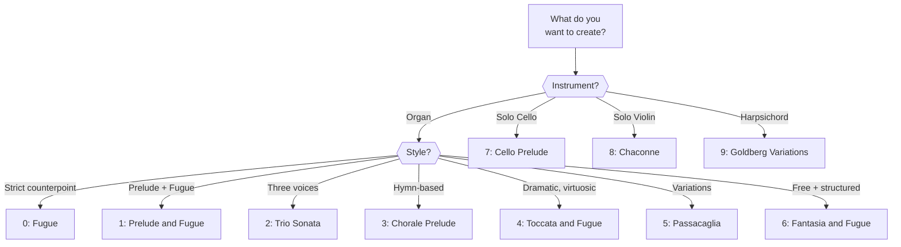

# Presets Reference

Complete reference for all configurable presets in MIDI Sketch Bach.

::: info Reading these tables
`ID` and `String` are API values. **Voices**, **meter**, **natural bars**, **key**, and **character** are musical structure choices. If those terms are new, keep the [Music Primer for Engineers](/docs/music-primer) open while reading this page.
:::

## Forms Reference

### All 10 Forms

| ID | Name | String | Category | Default Instrument | Voices | Meter | Natural Bars |
|----|------|--------|----------|-------------------|--------|-------|--------------|
| 0 | Fugue | `"fugue"` | Organ | Organ | 3 | 4/4 | 42 |
| 1 | Prelude and Fugue | `"prelude_and_fugue"` | Organ | Organ | 3 | 4/4 | 24 |
| 2 | Trio Sonata | `"trio_sonata"` | Organ | Organ | 3 | 4/4 | 16 |
| 3 | Chorale Prelude | `"chorale_prelude"` | Organ | Organ | 2 | 4/4 | 16 |
| 4 | Toccata and Fugue | `"toccata_and_fugue"` | Organ | Organ | 3 | 4/4 | 32 |
| 5 | Passacaglia | `"passacaglia"` | Organ | Organ | 2 | 3/4 | 24 |
| 6 | Fantasia and Fugue | `"fantasia_and_fugue"` | Organ | Organ | 3 | 4/4 | 32 |
| 7 | Cello Prelude | `"cello_prelude"` | Solo | Cello | 1 | 4/4 | 8 |
| 8 | Chaconne | `"chaconne"` | Solo | Violin | 2 | 3/4 | 16 |
| 9 | Goldberg Variations | `"goldberg_variations"` | Variation | Harpsichord | 3 | 4/4 | 20 |

::: info Bar counts
"Natural Bars" is the length when `scale: "short"`. The `scale` option multiplies it (~1x/2x/3x/4x), and `targetBars` overrides it. Every form caps at 128 bars.
:::

::: tip Natural bars are not seconds
A bar count is musical length, not wall-clock duration. Playback time also depends on `bpm` and meter. A 42-bar fugue at 80 BPM lasts longer than the same 42 bars at 140 BPM.
:::

### Form Selection Flowchart


```mermaid
graph TD
    A["What do you<br>want to create?"] --> B{{"Instrument?"}}
    B -->|"Organ"| C{{"Style?"}}
    B -->|"Solo Cello"| D["7: Cello Prelude"]
    B -->|"Solo Violin"| E["8: Chaconne"]
    B -->|"Harpsichord"| M["9: Goldberg Variations"]
    C -->|"Strict counterpoint"| F["0: Fugue"]
    C -->|"Prelude + Fugue"| G["1: Prelude and Fugue"]
    C -->|"Three voices"| H["2: Trio Sonata"]
    C -->|"Hymn-based"| I["3: Chorale Prelude"]
    C -->|"Dramatic, virtuosic"| J["4: Toccata and Fugue"]
    C -->|"Variations"| K["5: Passacaglia"]
    C -->|"Free + structured"| L["6: Fantasia and Fugue"]
```

::: info Organ System (Forms 0--6)
The seven organ forms cover the major genres of Bach's organ repertoire. All default to organ registration and typically use 2--3 voices. These forms feature the most sophisticated counterpoint, as the organ's sustained tones make every voice-leading detail audible.
:::

::: info Solo Instrument System (Forms 7--8)
The two solo forms generate music for unaccompanied string instruments. The cello prelude is a single continuous line; the chaconne pairs a ground bass with an upper line. Implied polyphony emerges through register shifts, arpeggiation, and chordal writing.
:::

::: info Variation System (Form 9)
The Goldberg Variations form is a theme-and-variations cycle over an immutable bass, defaulting to harpsichord.
:::

::: details BWV References by Form
| Form | Notable Bach Works |
|------|-------------------|
| Fugue | BWV 578 (G minor "Little" Fugue), BWV 542/2 |
| Prelude and Fugue | BWV 532, 541, 548, 846--893 (Well-Tempered Clavier) |
| Trio Sonata | BWV 525--530 (Six Trio Sonatas) |
| Chorale Prelude | BWV 599--644 (Orgelbüchlein), BWV 651--668 |
| Toccata and Fugue | BWV 565 (D minor), BWV 540 |
| Passacaglia | BWV 582 (C minor) |
| Fantasia and Fugue | BWV 537, 542, 561 |
| Cello Prelude | BWV 1007--1012 (Cello Suites) |
| Chaconne | BWV 1004/5 (Partita No. 2 in D minor) |
| Goldberg Variations | BWV 988 |
:::

## Instruments Reference

| ID | Name | String | GM Program | Sound | Typical Forms |
|----|------|--------|-----------|-------|---------------|
| 0 | Organ | `"organ"` | 19 | Church Organ | All organ forms (0--6) |
| 1 | Harpsichord | `"harpsichord"` | 6 | Harpsichord | Goldberg Variations (9), any form |
| 2 | Piano | `"piano"` | 0 | Acoustic Grand Piano | Any form |
| 3 | Violin | `"violin"` | 40 | Violin | Chaconne (8) |
| 4 | Cello | `"cello"` | 42 | Cello | Cello Prelude (7) |
| 5 | Guitar | `"guitar"` | 24 | Nylon Guitar | Solo forms (7--8) |

::: info Instrument does not decide the composition
The `instrument` selects MIDI sound, playable range, and ornament density. It does not change voice count, meter, form layout, or validator rules; those come from `form`.
:::

::: tip
While each form has a default instrument, you can override it with any instrument. For example, a fugue played on harpsichord has a distinctly different character than on organ — the harpsichord's crisp attack makes counterpoint lines more distinct.
:::

## Subject Characters

| ID | Name | String | Effect |
|----|------|--------|--------|
| 0 | Severe | `"severe"` | Strict, intellectually rigorous (default) |
| 1 | Playful | `"playful"` | Light, agile, rhythmically lively |
| 2 | Noble | `"noble"` | Stately, broad, dignified |
| 3 | Restless | `"restless"` | Driving, chromatic, dramatically charged |

::: info
The character parameter affects the melodic profile of the fugue subject or primary thematic material. It has the most noticeable effect on fugal forms, where the subject defines the character of the entire piece. Two combinations are forbidden and throw: `chorale_prelude` rejects `playful`/`restless`, and `toccata_and_fugue` rejects `noble`.
:::

## Scale Modes

`scale` multiplies the form's natural length. `targetBars` overrides it.

| ID | Name | String | Approximate Length |
|----|------|--------|--------------------|
| 0 | Short | `"short"` | ~1x natural (default) |
| 1 | Medium | `"medium"` | ~2x natural |
| 2 | Long | `"long"` | ~3x natural |
| 3 | Full | `"full"` | ~4x natural |

::: tip
The actual output length depends on each form's natural length (see the Forms Reference table above): the same `scale` produces different bar counts for different forms because each scales from its own natural length. Use `targetBars` for precise length control; values are clamped to `[form minimum, 128]`.
:::

## Key Reference

| ID | Name | Pitch Class | Common Baroque Associations |
|----|------|-------------|---------------------------|
| 0 | C | C | Purity, simplicity, clarity |
| 1 | C# / Db | C# | Devotion, depth |
| 2 | D | D | Triumph, brilliance (D major); passion, drama (D minor) |
| 3 | D# / Eb | Eb | Heroic grandeur, nobility |
| 4 | E | E | Joy, brightness (E major); lament (E minor) |
| 5 | F | F | Pastoral, calm |
| 6 | F# / Gb | F# | Intensity, brilliance |
| 7 | G | G | Grace, simplicity (G major); seriousness (G minor) |
| 8 | G# / Ab | Ab | Solemn, devotional |
| 9 | A | A | Tenderness, elegance (A major); gentle melancholy (A minor) |
| 10 | A# / Bb | Bb | Nobility, warmth |
| 11 | B | B | Hard brilliance (B major); somber weight (B minor) |

::: info Pitch class and mode
`key` chooses the pitch class, such as C or D. `isMinor` chooses major or minor. For example, `key: 2, isMinor: false` is D major; `key: 2, isMinor: true` is D minor.
:::

::: info Key Associations in Baroque Music
Baroque composers associated specific keys with emotional qualities (*Affektenlehre*). D minor was the key of passion and drama (BWV 565 Toccata and Fugue), while C major represented purity (BWV 846 Prelude). These associations are subjective and vary by era, but they influenced Bach's choice of key for his compositions.
:::

All keys work with both `isMinor: false` (major) and `isMinor: true` (minor).

## Default Mapping

Cross-reference of form defaults (voices and meter are fixed by the form; BPM defaults to 100 unless you set it):

| Form | Instrument | Voices | Meter | Natural Bars |
|------|-----------|--------|-------|--------------|
| Fugue | Organ (0) | 3 | 4/4 | 42 |
| Prelude and Fugue | Organ (0) | 3 | 4/4 | 24 |
| Trio Sonata | Organ (0) | 3 | 4/4 | 16 |
| Chorale Prelude | Organ (0) | 2 | 4/4 | 16 |
| Toccata and Fugue | Organ (0) | 3 | 4/4 | 32 |
| Passacaglia | Organ (0) | 2 | 3/4 | 24 |
| Fantasia and Fugue | Organ (0) | 3 | 4/4 | 32 |
| Cello Prelude | Cello (4) | 1 | 4/4 | 8 |
| Chaconne | Violin (3) | 2 | 3/4 | 16 |
| Goldberg Variations | Harpsichord (1) | 3 | 4/4 | 20 |

## Programmatic Access

Use the preset enumeration functions to access these values at runtime:

```js
import {
  getForms,
  getInstruments,
  getCharacters,
  getKeys,
  getScales,
  getVersion
} from '@libraz/midi-sketch-bach'

// List all forms
const forms = getForms()
for (const form of forms) {
  console.log(`${form.id}: ${form.display ?? form.name}`)
}
// 0: Fugue
// 1: Prelude and Fugue
// 2: Trio Sonata
// 3: Chorale Prelude
// 4: Toccata and Fugue
// 5: Passacaglia
// 6: Fantasia and Fugue
// 7: Cello Prelude
// 8: Chaconne
// 9: Goldberg Variations

// List all instruments
const instruments = getInstruments()
// [{ id: 0, name: "organ" }, ...]

// List all keys
const keys = getKeys()
// [{ id: 0, name: "C" }, { id: 1, name: "C#" }, ...]
```

::: tip
These functions are useful for building UI components like dropdowns or form selectors. The demo on this site uses them to populate the form selection interface.
:::
