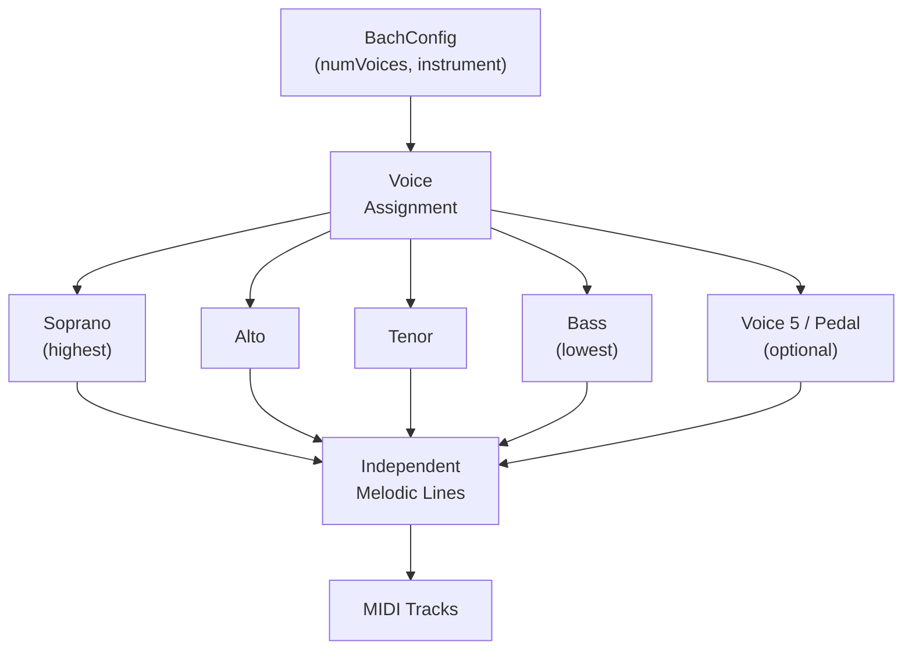
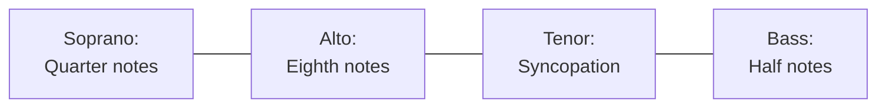

# Voice Architecture

Each voice in a MIDI Sketch Bach composition operates as an independent melodic line, following Baroque conventions for register, independence, and voice leading.

::: info What is a Voice?
In Baroque music, a "voice" is an independent melodic line — whether sung by a human voice or played on an instrument. A four-voice fugue has four simultaneous melodic lines, each with its own rhythm, contour, and identity. On a keyboard instrument like the organ, a single performer plays all voices simultaneously. In MIDI Sketch Bach, each voice becomes a separate MIDI track.
:::

## Voice System Overview



## Voice Types and Roles

| Voice | Role | Register | Typical Function |
|-------|------|----------|-----------------|
| Soprano | Highest voice | Upper | Carries main melody, subject entries, cantus firmus in chorale preludes |
| Alto | Inner upper voice | Mid-upper | Secondary counterpoint, fills harmonic texture |
| Tenor | Inner lower voice | Mid-lower | Secondary counterpoint, dialogue with alto |
| Bass | Lowest voice | Lower | Harmonic foundation, pedal points, bass themes in passacaglia |
| Voice 5 (Pedal) | Extended bass | Lowest | Organ pedal bass, separate from manual voices |

### Voice Allocation by Count

| numVoices | Voices Used |
|-----------|-------------|
| 2 | Soprano, Bass |
| 3 | Soprano, Alto, Bass |
| 4 | Soprano, Alto, Tenor, Bass |
| 5 | Soprano, Alto, Tenor, Bass, Pedal |

## Voice Ranges

Each voice's pitch range is determined by the instrument and voice count. The engine ensures that voices occupy distinct registers to maintain clarity.

::: info Tessatura
In vocal and instrumental music, the *tessatura* is the comfortable range where a voice or instrument sounds best — not the extreme limits, but the central working range. The engine keeps each voice primarily within its tessatura, using the extremes sparingly for expressive effect.
:::

### Organ Voice Ranges (Approximate)

| Voice | Range | MIDI Notes |
|-------|-------|------------|
| Soprano | C4--C6 | 60--84 |
| Alto | G3--G5 | 55--79 |
| Tenor | C3--C5 | 48--72 |
| Bass | G2--G4 | 43--67 |
| Pedal | C2--C4 | 36--60 |

### Solo Instrument Ranges

| Instrument | Range | MIDI Notes |
|------------|-------|------------|
| Violin | G3--E7 | 55--100 |
| Cello | C2--A5 | 36--81 |

Ranges are adjusted when fewer voices are used, giving each voice more registral space.

## Voice Independence

Maintaining the independence of each voice is a core principle of Baroque counterpoint. The engine ensures independence through three mechanisms:

### Rhythmic Differentiation

Voices use different rhythmic patterns to avoid moving in lockstep:



When one voice has a sustained note, others tend to be active, and vice versa. This rhythmic complementarity is a hallmark of Bach's contrapuntal writing.

### Melodic Differentiation

Each voice has its own melodic character:

- Different intervallic profiles (some voices more stepwise, others with more leaps)
- Different directional tendencies at any given moment
- Each voice develops thematic material independently

### Register Differentiation

Voices maintain separation in pitch space:

- Each voice stays primarily in its assigned range
- Voice crossing is minimized
- When voices approach each other in register, they tend to move apart

## Voice Count by Form

| Form | Default Voices | Valid Range | Notes |
|------|---------------|-------------|-------|
| 0: Fugue | 4 | 2--5 | Classic 3-4 voice fugue |
| 1: Prelude and Fugue | 4 | 2--5 | Prelude may use fewer voices |
| 2: Trio Sonata | 3 | 3 | Fixed: two upper + pedal bass |
| 3: Chorale Prelude | 4 | 3--5 | Cantus firmus + accompaniment |
| 4: Toccata and Fugue | 4 | 3--5 | Toccata may use full range |
| 5: Passacaglia | 4 | 3--5 | Voice count may increase across variations |
| 6: Fantasia and Fugue | 4 | 3--5 | Fantasia may use variable voicing |
| 7: Cello Prelude | 3 | 2--3 | Implied voices on solo instrument |
| 8: Chaconne | 3 | 2--4 | Implied voices on solo violin |

## Piano Roll Colors

In the demo's piano roll visualization, each voice is assigned a distinct color from the cathedral design palette:

| Voice | Color | Hex |
|-------|-------|-----|
| Soprano (Voice 1) | Gold | `#D4A63E` |
| Alto (Voice 2) | Burgundy | `#6B1D2A` |
| Tenor (Voice 3) | Green | `#2D5A3D` |
| Bass (Voice 4) | Steel Blue | `#4A7C9B` |
| Voice 5 (Pedal) | Bronze | `#8B6914` |

## Voice-to-Track Mapping

Each voice maps to a separate MIDI track with its own channel and program:

```js
const events = generator.getEvents()

for (const track of events.tracks) {
  console.log(`Voice: ${track.name}`)      // "Soprano", "Alto", etc.
  console.log(`Channel: ${track.channel}`)  // MIDI channel (0-15)
  console.log(`Program: ${track.program}`)  // GM program number
  console.log(`Notes: ${track.note_count}`) // Number of notes
}
```

### General MIDI Program Mapping

| Instrument | GM Program | Sound |
|------------|-----------|-------|
| Organ | 19 | Church Organ |
| Harpsichord | 6 | Harpsichord |
| Piano | 0 | Acoustic Grand Piano |
| Violin | 40 | Violin |
| Cello | 42 | Cello |
| Guitar | 24 | Acoustic Guitar (Nylon) |

All voices within a composition use the same instrument program by default. The MIDI output is a Type 1 Standard MIDI File with separate tracks for each voice, allowing you to reassign instruments per voice in your DAW.
