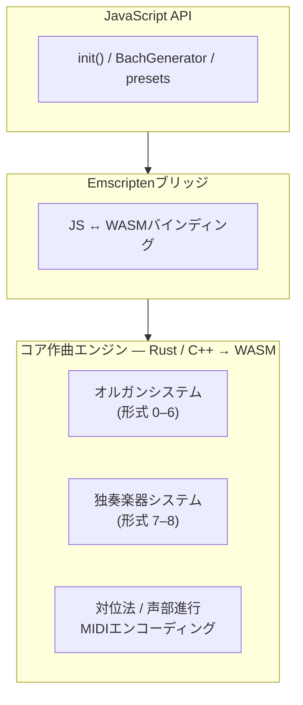
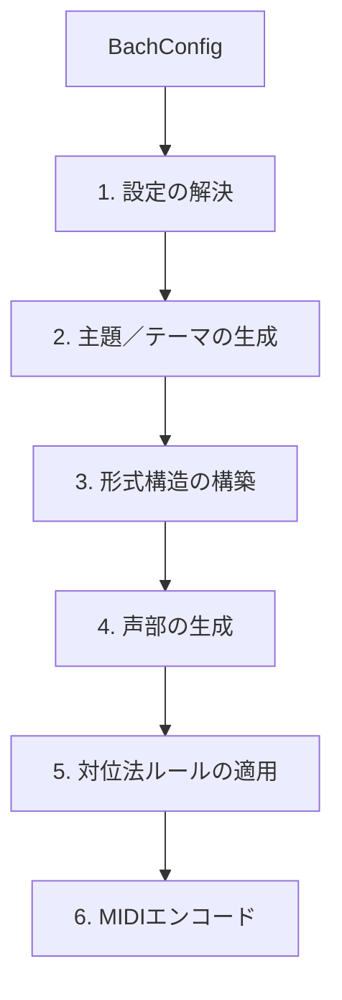

# アーキテクチャ

## 概要

::: info MIDI Sketch Bachとは？
MIDI Sketch Bachは、機械学習ではなくルールベースの対位法を使用してバロック様式の器楽曲MIDIを生成するアルゴリズム作曲エンジンです。すべての音符は音楽理論の制約と決定論的アルゴリズムによって決定され、任意のDAWにインポート可能な編集可能なMIDIデータを出力します。
:::

MIDI Sketch Bachは、コア作曲エンジンをWebAssemblyにコンパイルし、その上に高水準のJavaScript APIを提供しています。

## 2つの作曲システム

### オルガンシステム（形式 0--6）

オルガンシステムは、バッハのオルガン・レパートリーの主要ジャンルにまたがる7つの形式を含む大規模なオルガン作品を担当します。

- **フーガ** (0) -- 提示部、展開部、ストレッタを持つ独立したフーガ
- **前奏曲とフーガ** (1) -- 流麗な前奏曲から精緻なフーガへ
- **トリオ・ソナタ** (2) -- 3声部テクスチュア（2つの上声部＋ペダルバス）
- **コラール前奏曲** (3) -- 定旋律処理と独立した伴奏
- **トッカータとフーガ** (4) -- 自由なトッカータセクションと厳格なフーガからなる多セクション作品
- **パッサカリア** (5) -- オスティナートバス上の連続変奏形式
- **幻想曲とフーガ** (6) -- 自由な幻想曲と構造的なフーガの組み合わせ

これらの形式は通常3--4声部を使用し、デフォルトでオルガンのレジストレーションが適用されます。

### 独奏楽器システム（形式 7--8）

独奏楽器システムは、無伴奏弦楽器のための作品を担当します。

- **チェロ前奏曲** (7) -- バッハの無伴奏チェロ組曲をモデルとした独奏チェロのための流麗な前奏曲
- **シャコンヌ** (8) -- パルティータ第2番のシャコンヌに着想を得た独奏ヴァイオリンのための壮大な変奏形式

これらの形式は3声部を使用し、デフォルトでチェロまたはヴァイオリンが適用されます。

## 生成パイプライン

`generator.generate(config)` を呼び出すと、6段階のパイプラインが実行されます。各ステップの詳細については[生成パイプライン](/ja/docs/generation-pipeline)ページを参照してください。

1. **設定の解決** -- すべてのオプションを解決し、未指定フィールドに形式のデフォルト値を適用
2. **主題/テーマの生成** -- 調、旋法、キャラクターに基づいて主要な旋律素材を生成
3. **形式構造の構築** -- マクロレベルの構造を構築（提示部、エピソード、変奏など）
4. **声部の生成** -- 各声部をその音域内で独立して生成
5. **対位法ルールの適用** -- 声部間の音程関係を検証・調整
6. **MIDIエンコード** -- 標準MIDIファイル形式にマッピング

::: tip
各ステップの詳細な説明（異なる形式ファミリーがどのように構造を処理するかを含む）は[生成パイプライン](/ja/docs/generation-pipeline)をご覧ください。
:::

## 声部アーキテクチャ

MIDI Sketch Bachの楽曲における各声部は、バロック時代の声部独立性と声部進行の慣習に従った独立した旋律線として機能します。詳細については[声部アーキテクチャ](/ja/docs/voice-architecture)ページを参照してください。

主要な原則：

- **音域の分離** -- 各声部は重複を最小限にする明確な音域を持つ
- **リズムの独立性** -- 異なるリズムパターンが声部のアイデンティティを維持
- **順次進行の優先** -- 声部は跳躍よりも順次進行で動くことが多い
- **跳躍の解決** -- 大きな跳躍の後は反対方向への順次進行が続く
- **カデンツパターン** -- 標準的な定型がフレーズとセクションを締めくくる

::: tip
声部がどのように相互作用するかを規定する音楽理論のルールについては[対位法と声部進行](/ja/docs/counterpoint)をご覧ください。
:::

## WASM統合

作曲エンジンは、ポータブルで高性能な実行のためにWebAssemblyにコンパイルされています。

- **初期化**: `init()` がWASMモジュールをロードしインスタンス化
- **メモリ管理**: `BachGenerator` がWASMメモリを確保し、`destroy()` で解放
- **データ転送**: MIDI出力はWASMメモリからJavaScriptの `Uint8Array` にコピー
- **イベントデータ**: 構造化イベントデータはWASMからシリアライズされJavaScriptでパース
