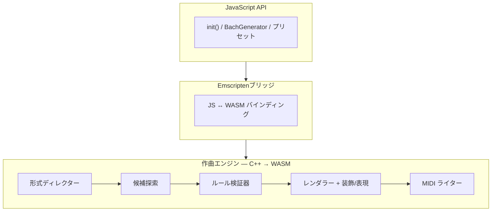

# アーキテクチャ

::: info 音楽用語の読み替え
このページでは音楽用語をデータモデル上の用語として使います。**声部**は旋律ストリーム、**和声**は時間に沿った和音プラン、**形式**は作曲テンプレートです。短い定義は[エンジニアのための音楽用語入門](/ja/docs/music-primer)にまとめています。
:::

## 概要

::: info MIDI Sketch Bachとは？
MIDI Sketch Bach は、機械学習ではなく規則ベースの作曲によってバロック風器楽曲の MIDIを生成するアルゴリズム作曲エンジンです。すべてのノートは和声プランと対位法制約によって決定され、あらゆるDAW にインポートできる編集可能な MIDIを生成します。
:::

C++の作曲エンジンがWebAssemblyにコンパイルされ、その上にJavaScript APIが載っています。

```mermaid
graph TD
    subgraph JS["JavaScript API"]
        A["init() / BachGenerator / プリセット"]
    end
    subgraph EM["Emscriptenブリッジ"]
        B["JS ↔ WASM バインディング"]
    end
    subgraph CORE["作曲エンジン — C++ → WASM"]
        C["形式ディレクター"]
        D["候補探索"]
        E["ルール検証器"]
        F["レンダラー + 装飾/表現"]
        G["MIDI ライター"]
        C --> D --> E --> F --> G
    end
    JS --> EM --> CORE
```

## 作曲エンジン

単一のコンポーザーサブシステムがすべての形式を処理します。ジャンルごとに別々のジェネレータを持つのではなく、各形式を和声プラン上の**ボイスインテントのレイアウト**として表現し、そのレイアウトを埋め、検証し、レンダリングします。テクスチュア（声部数・拍子・基準長）は形式が決定し、声部数オプションは存在しません。

::: info ボイスインテントと和声プラン
**ボイスインテント**は、ある小節範囲で一つの旋律ストリームに割り当てる役割です。主題、応答、グラウンドバス、音型などが該当します。**和声プラン**は、候補探索が従う和音のロードマップです。
:::

パイプラインは次のとおりです。

1. **作曲リクエスト** — 設定を解決・検証し、シードを解決し、形式から声部数/拍子/長さを固定。
2. **形式ディレクター** — 形式別のボイスインテント（主題、グラウンド、定旋律、音型、変奏）を小節スパンに割り当て。
3. **候補探索** — 和声プランに対する拍ごと・和声音固定のノート選択。
4. **ルール検証器** — 対位法・構造の検査、即時失敗。
5. **レンダラー** — 声部をトラックへ。
6. **装飾と表現** — 決定論的な後処理。`Composer::run()` の外に置かれ、公開生成経路から呼び出される。
7. **MIDI ライター** — 調の移調と標準 MIDI ファイル出力。

段階ごとの詳細は[生成パイプライン](/ja/docs/generation-pipeline)を参照してください。

## デザイン値のアーク

構造は固定のデザインアーク — **提示 → 展開 → クライマックス（スパンの約80%）→ 解決** — に従い、密度・音域・ベロシティの段階を制御します。アークは形式の性質であり、シードごとに探索されるものではないため、出力は音楽的に整い再現可能に保たれます。

::: info 密度、音域、ベロシティ
**密度**は一定範囲にどれだけ多くの音があるかです。**音域**は低音・高音のような高さの範囲です。**ベロシティ**はMIDIの音の強さです。アークはこれらを上下させ、単調な音列ではなくフレーズ感のある出力にします。
:::

## 形式ファミリー

形式ディレクターはいくつかのレイアウトファミリーを処理します。

- **フーガ系**（`fugue`、`prelude_and_fugue`、`toccata_and_fugue`、`fantasia_and_fugue`） — エピソードを伴う主題/応答の提示。
- **グラウンドバス変奏**（`passacaglia`、`chaconne`、`goldberg_variations`） — 不変のバスと連続する変奏サイクル。`goldberg_variations` はアリアと音程を広げていくカノンを含む30変奏を構築し、`passacaglia`/`chaconne` はサイクルを3/4で展開します。
- **定旋律**（`chorale_prelude`） — 固定されたコラール線と対位法声部。
- **線的/音型**（`trio_sonata`、`cello_prelude`） — 相互作用する声部、または連続的な音型。

## 決定論性

エンジンは完全に決定論的です。同じ設定とシードはバイト単位で同一の出力を生成します。作曲は内部的に C で行われ、指定された調はMIDI ライターでのみ適用されるため、イベント JSON は常にピッチを C で報告し、`.mid` ファイルは移調されます。

::: info なぜイベントは C のままなのか
内部イベントデータを C のままにすると、異なる調でも検証器の挙動を比較しやすくなります。同じ形式とシードの構造を、最後の移調前の状態で確認できるからです。MIDI ファイル自体は、指定された調で書き出されます。
:::

## WASM統合

- **初期化**: `init()` がWASM モジュールをロードしインスタンス化します。
- **メモリ管理**: `BachGenerator` がWASM メモリを確保し、`destroy()` が解放します。
- **データ転送**: MIDI 出力はWASM メモリからJavaScript の `Uint8Array` へコピーされ、イベントデータはWASM からシリアライズされてJavaScript でパースされます。
