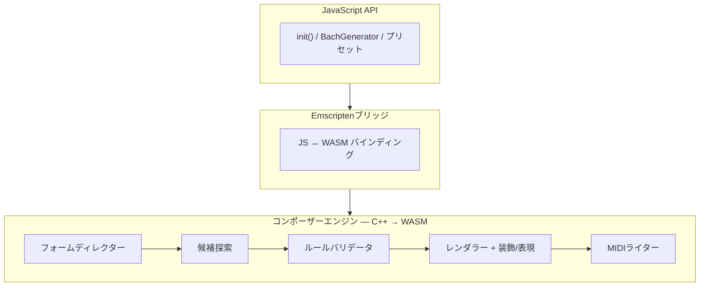

# アーキテクチャ

## 概要

::: info MIDI Sketch Bachとは？
MIDI Sketch Bachは、機械学習ではなく規則ベースの作曲によってバロックスタイルの器楽曲MIDIを生成するアルゴリズム作曲エンジンです。すべてのノートは和声プランと対位法制約によって決定され、あらゆるDAWにインポートできる編集可能なMIDIを生成します。
:::

C++のコンポーザーエンジンがWebAssemblyにコンパイルされ、その上にJavaScript APIが載っています。

```mermaid
graph TD
    subgraph JS["JavaScript API"]
        A["init() / BachGenerator / プリセット"]
    end
    subgraph EM["Emscriptenブリッジ"]
        B["JS ↔ WASM バインディング"]
    end
    subgraph CORE["コンポーザーエンジン — C++ → WASM"]
        C["フォームディレクター"]
        D["候補探索"]
        E["ルールバリデータ"]
        F["レンダラー + 装飾/表現"]
        G["MIDIライター"]
        C --> D --> E --> F --> G
    end
    JS --> EM --> CORE
```

## コンポーザーエンジン

単一のコンポーザーサブシステムがすべての形式を処理します。ジャンルごとに別々のジェネレータを持つのではなく、各形式を和声プラン上の**ボイスインテントのレイアウト**として表現し、そのレイアウトを埋め、検証し、レンダリングします。テクスチュア（声部数・拍子・自然長）は形式が決定し、声部数オプションは存在しません。

パイプラインは次のとおりです。

1. **コンポーズリクエスト** — 設定を解決・検証し、シードを解決し、形式から声部数/拍子/長さを固定。
2. **フォームディレクター** — 形式別のボイスインテント（主題、グラウンド、定旋律、音型、変奏）を小節スパンに割り当て。
3. **候補探索** — 和声プランに対する拍ごと・和声音固定のノート選択。
4. **ルールバリデータ** — 対位法・構造の検査、即時失敗。
5. **レンダラー** — 声部をトラックへ。
6. **装飾と表現** — オプトインの決定論的後処理パス。
7. **MIDIライター** — 調の移調と標準MIDIファイル出力。

段階ごとの詳細は[生成パイプライン](/ja/docs/generation-pipeline)を参照してください。

## デザイン値のアーク

構造は固定のデザインアーク — **提示 → 展開 → クライマックス（スパンの約80%）→ 解決** — に従い、密度・音域・ベロシティの段階を制御します。アークは形式の性質であり、シードごとに探索されるものではないため、出力は音楽的に整い再現可能に保たれます。

## 形式ファミリー

フォームディレクターはいくつかのレイアウトファミリーを処理します。

- **フーガ系**（`fugue`、`prelude_and_fugue`、`toccata_and_fugue`、`fantasia_and_fugue`） — エピソードを伴う主題/応答の提示。
- **グラウンドバス変奏**（`passacaglia`、`chaconne`、`goldberg_variations`） — 不変のバスと連続する変奏サイクル。`goldberg_variations` はアリアと音程を広げていくカノンを含む30変奏を構築し、`passacaglia`/`chaconne` はサイクルを3/4で展開します。
- **定旋律**（`chorale_prelude`） — 固定されたコラール線と対位法声部。
- **線的/音型**（`trio_sonata`、`cello_prelude`） — 相互作用する声部、または連続的な音型。

## 決定論性

エンジンは完全に決定論的です。同じ設定とシードはバイト単位で同一の出力を生成します。作曲は内部的にCで行われ、指定された調はMIDIライターでのみ適用されるため、イベントJSONは常にピッチをCで報告し、`.mid` ファイルは移調されます。

## WASM統合

- **初期化**: `init()` がWASMモジュールをロードしインスタンス化します。
- **メモリ管理**: `BachGenerator` がWASMメモリを確保し、`destroy()` が解放します。
- **データ転送**: MIDI出力はWASMメモリからJavaScriptの `Uint8Array` へコピーされ、イベントデータはWASMからシリアライズされてJavaScriptでパースされます。
