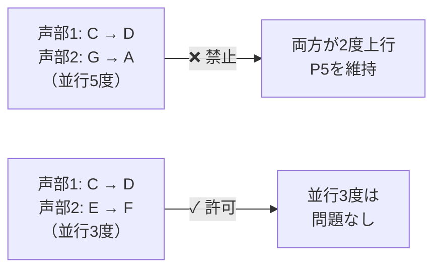
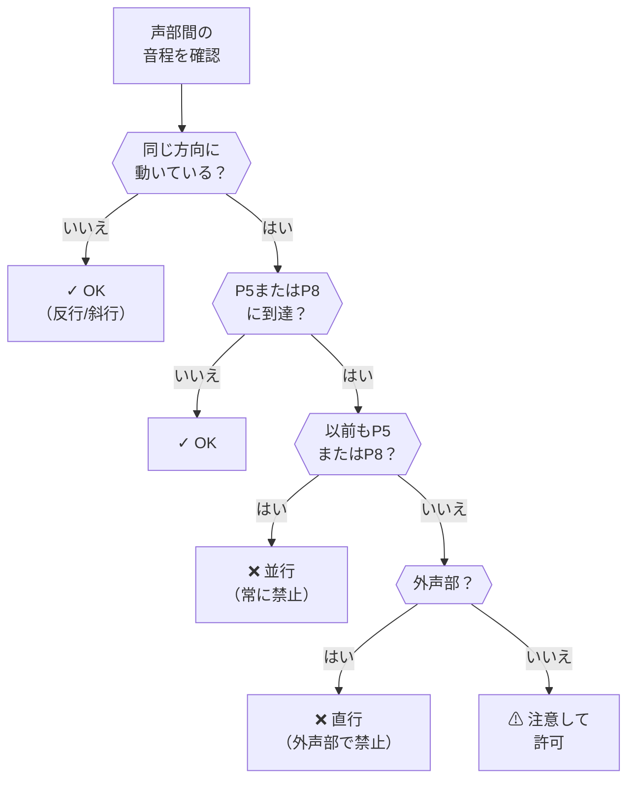
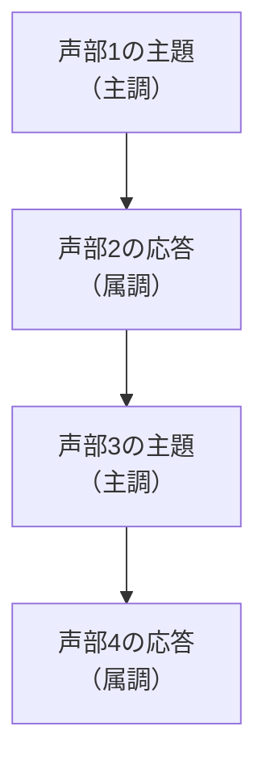
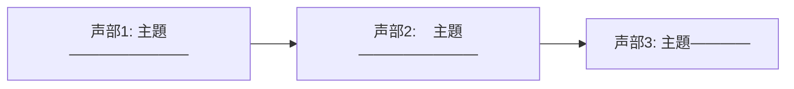

# 対位法と声部進行

このページでは、MIDI Sketch Bachが正統的なバロックスタイルの対位法を生成するために使用する音楽理論のルールを説明します。これらのルールは、複数の独立した旋律線（声部）がどのように相互作用するかを規定します。

::: info エンジニアのための対位法
対位法は制約充足問題として考えることができます。各声部は独立したスレッドであり、すべての拍で他のすべての声部に対する音程の制約を満たさなければなりません。以下のルールがその制約であり、エンジンはそれらすべてを同時に満たしつつ音楽的にも魅力的な解を見つけます。
:::

## 協和音と不協和音

バロック対位法では、2つの声部間のすべての音程は協和（安定的、静穏的）または不協和（不安定的、解決を必要とする）に分類されます。

### 音程の分類

| 音程 | 半音数 | 分類 | 用法 |
|------|--------|------|------|
| ユニゾン | 0 | 完全協和音 | 開始と終止 |
| 短2度 | 1 | 不協和音 | 経過音、掛留音 |
| 長2度 | 2 | 不協和音 | 経過音、掛留音 |
| 短3度 | 3 | 不完全協和音 | 自由に使用可能 |
| 長3度 | 4 | 不完全協和音 | 自由に使用可能 |
| 完全4度 | 5 | 文脈依存 | 上声部間では協和；バスに対しては不協和 |
| 三全音 | 6 | 不協和音 | 解決が必要 |
| 完全5度 | 7 | 完全協和音 | 強い和声的支持 |
| 短6度 | 8 | 不完全協和音 | 自由に使用可能 |
| 長6度 | 9 | 不完全協和音 | 自由に使用可能 |
| 短7度 | 10 | 不協和音 | 掛留音、属機能 |
| 長7度 | 11 | 不協和音 | 掛留音、導音 |
| オクターヴ | 12 | 完全協和音 | 開始と終止 |

::: tip
不完全協和音（3度と6度）は対位法の「スイートスポット」です — 和声的に美しく響きながら声部の独立性を保ちます。エンジンは通常の対位法的進行でこれらの音程を好んで使用します。
:::

## 禁則並行

バロック対位法の最も基本的なルールは*並行進行*に関するものです — 2つの声部が同じ方向に同じ音程で動くことです。

::: warning 並行5度と並行8度
2つの声部は並行5度（完全5度の関係を保ちながら両方の声部が上昇または下降）または並行8度/ユニゾンで動いてはなりません。これらの並行は、2つの声部を単一のダブリングされた線のように聞こえさせ、声部の独立性を破壊します。
:::

エンジンは**直行（隠伏）5度・8度**も確認します：2つの声部が同じ方向に動いて完全5度または8度に到達する場合（たとえ以前その音程でなくても）。これは外声部（ソプラノとバス）間では回避されます。

### 検証フロー

## 不協和音の処理

バロック対位法では、不協和音は未解決のまま放置されることはありません。すべての不協和音は特定のパターンに従って導入・解決されなければなりません。

### 掛留音

掛留音は不協和音処理の最も表現力豊かな形式です — 協和音が次の拍に*保持*（掛留）されてそこで不協和になり、その後2度下行して解決します。

一般的な掛留のタイプ：

| 掛留 | 音程 | 解決 |
|------|------|------|
| 4-3 | 4度が3度に解決 | 上声部で最も一般的 |
| 7-6 | 7度が6度に解決 | 上声部で一般的 |
| 9-8 | 9度がオクターヴに解決 | 強い緊張感を生む |
| 2-3 | 2度が3度に解決 | 「バス掛留」（上行解決） |

::: tip
掛留音はバロック対位法における表現的な美の主要な源泉の一つです。保持された音符と動く声部の間の一瞬の衝突が、満足のいく解決へと至る感情的緊張を生み出します。バッハは特にゆっくりした楽章やコラール前奏曲で掛留音を多用しました。
:::

### 経過音

経過音は2つの協和音の間の隙間を順次進行で埋めます。弱拍に出現し、2つの協和音を結びます。

- 前の音は協和
- 経過音は不協和（弱拍上）
- 後の音は協和
- 動きは一方向への順次進行

### 刺繍音（隣接音）

刺繍音は協和音を装飾します。2度離れて戻ります。

- 協和音から開始
- 2度進行で不協和音に移動（弱拍上）
- 2度進行で元の音に戻る

## 声部進行の原則

### 順次進行

声部は主に2度（順次進行）で動くべきです。跳躍（3度以上）は控えめかつ意図的に使用するべきです。

| 動きのタイプ | 音程 | 用法 |
|-------------|------|------|
| 順次進行 | 2度（1-2半音） | 主要な動き、常に使用可能 |
| 小跳躍 | 3度（3-4半音） | 一般的、旋律的関心を加える |
| 中跳躍 | 4-5度（5-7半音） | 構造的なポイントで使用 |
| 大跳躍 | 6度以上（8半音以上） | まれ、解決が必要 |

### 跳躍の解決

声部が跳躍する場合、以下のルールが適用されます。

- **大跳躍（6度以上）の後**: 声部は反対方向に順次進行しなければならない
- **2回連続の跳躍の後**: 声部は方向を変えるべき
- **跳躍は協和音程を輪郭づけるべき**: 3度、4度、5度、6度、オクターヴ

### 反行

可能な場合、声部は反対方向に動くべきです（*反行*）。これは声部の独立性を維持する最も効果的な方法です。

| 動きのタイプ | 説明 | 独立性 |
|-------------|------|--------|
| 反行 | 声部が反対方向に動く | 最も強い |
| 斜行 | 一方が動き、他方が保持 | 強い |
| 同方向 | 同じ方向、異なる音程 | 中程度 |
| 並行 | 同じ方向、同じ音程 | 最も弱い（制限あり） |

### 声部交差の回避

声部は一般的に割り当てられた音域内にとどまるべきです。アルトがソプラノより上に行ったり、テナーがバスより下に行くと、どの声部がどれかについて混乱を生じます。エンジンは不必要な声部交差を防止しつつ、音楽的に正当化される場合（密集したストレッタなど）には許可します。

## カデンツ定型

カデンツは音楽の「句読点」です — フレーズの終わりと構造的な境界を定義します。

::: info 音楽的句読点としてのカデンツ
文章にピリオドとコンマが必要なように、音楽フレーズにはカデンツが必要です。半終止はコンマのようなもの（休止するが継続）で、完全終止はピリオドのようなもの（完結）です。エンジンは生成パイプラインで決定された形式構造に従ってカデンツを配置します。
:::

### カデンツのタイプ

| カデンツ | 和声進行 | 音楽的効果 | 典型的な配置 |
|---------|---------|-----------|-------------|
| 完全終止 | V → I | 完全な終結感、終止感 | セクション末、最終カデンツ |
| 半終止 | → V | 開放的、期待感 | フレーズ中間、移行点 |
| 偽終止 | V → vi | 意外性、継続 | フレーズの拡張 |
| 変終止 | IV → I | 「アーメン」カデンツ、穏やかな終結 | 補足的な終止 |

## フーガの対位法

フーガには一般原則を超える追加の対位法ルールがあります。

### 主題と応答

主題が2番目の声部に入る際、属調（5度上または4度下）に移調されます。この移調 — *応答* — は以下のいずれかです。

- **真正応答**: 属調への正確な移調
- **変容応答**: 主音-属音関係を主要な構造的ポイントで維持するために修正

### 対主題

対主題は、主題が出現するたびにそれに伴う副次的テーマです。転回可能に設計されており、主題の上でも下でも機能します。

### ストレッタ

ストレッタでは、前の声部が主題の提示を終える前に次の声部が主題を開始します。これにより重畳する提示が生まれ、緊張感が高まります。

提示が密接であるほど、ストレッタはより激しくなります。バッハはしばしばフーガの終盤近くのクライマックスの瞬間のために最も密接なストレッタを残しました。

## オスティナート系形式

パッサカリアとシャコンヌでは、バス主題（パッサカリア）または和声進行（シャコンヌ）が楽曲全体を通じて繰り返されます。追加の対位法制約が適用されます。

- バスパターンはすべての変奏を通じて認識可能でなければならない
- 上声部は増大する独立性と複雑さを獲得する
- 変奏の進行に伴い声部数が増加する場合がある
- 最終変奏はしばしば最も密な対位法を特徴とする

## 定旋律処理

コラール前奏曲では、既存の旋律（定旋律）が1つの声部に長い音符で現れます。伴奏声部の対位法ルールには以下が含まれます。

- 声部は定旋律の旋律を不明瞭にしてはならない
- 伴奏声部は定旋律の長い音符と対比するためにリズム的に活発であるべき
- 定旋律との和声的音程は標準的な協和/不協和ルールに従わなければならない
- 定旋律の各フレーズは通常、伴奏声部の短い予備的パッセージが先行する
