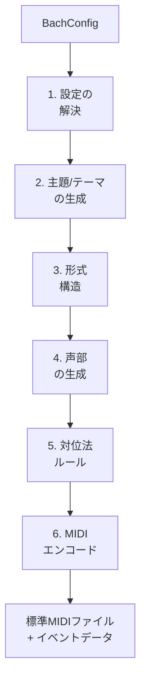
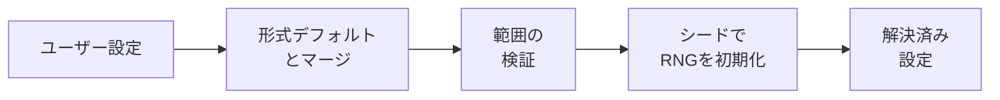
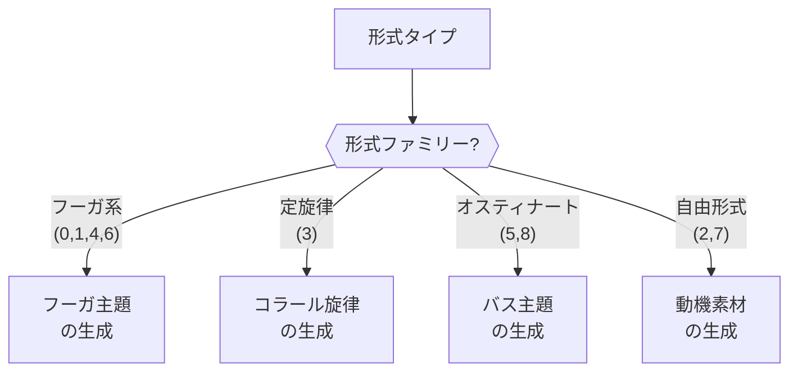
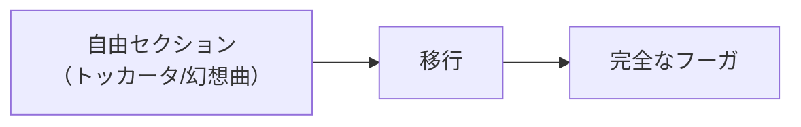
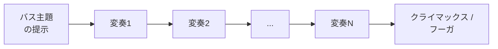
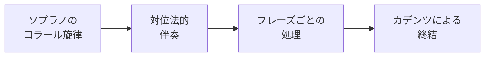
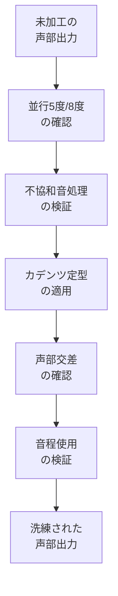

# 生成パイプライン

`generator.generate(config)` を呼び出すと、エンジンは設定オブジェクトを完全なバッハスタイルの楽曲に変換する6段階のパイプラインを実行します。



## ステップ1: 設定の解決

エンジンはすべての設定オプションを解決し、未指定フィールドにデフォルト値を適用します。各形式にはデフォルトの楽器、声部数、テンポが定義されています。



::: info デフォルト値の連鎖
`form: 'fugue'` のみを指定して他のオプションを省略した場合、エンジンは instrument = organ、voices = 4、BPM = 85 を適用します。明示的に設定したフィールドは形式のデフォルトを上書きします。完全な依存関係グラフについては[オプション関係](/ja/docs/option-relationships)をご覧ください。
:::

| フィールド | 解決順序 |
|-----------|---------|
| `form` | 必須（デフォルト: 0 = フーガ） |
| `instrument` | ユーザー値 → 形式のデフォルト |
| `numVoices` | ユーザー値 → 形式のデフォルト |
| `bpm` | ユーザー値 → 形式のデフォルト（0は形式のデフォルトを使用） |
| `key` | ユーザー値 → 0（C） |
| `isMinor` | ユーザー値 → false（長調） |
| `seed` | ユーザー値 → 0（ランダム） |
| `scale` | ユーザー値 → 1（medium） |
| `targetBars` | ユーザー値 → scaleにより決定 |
| `character` | ユーザー値 → 0（balanced） |

## ステップ2: 主題/テーマの生成

エンジンは楽曲全体の構成の種となる主要な旋律素材を生成します。アプローチは形式ファミリーによって異なります。



::: info フーガ主題とは？
バロック音楽において、フーガ主題（ラテン語: *subjectum*）はフーガ全体の基盤となる短い旋律テーマです。通常1〜4小節で、すべての声部が最終的にこの主題を提示し、すべてのエピソードと展開部分がそこから派生します。主題の質が、フーガ全体の質を大きく左右します。
:::

### キャラクターの影響

`character` パラメータは生成されるテーマの旋律プロファイルを形作ります。

| キャラクター | 主題への効果 |
|-------------|-------------|
| 0（バランス型） | 順次進行と跳躍の混合、適度なリズム |
| 1（叙情的） | 主に順次進行、滑らかな輪郭 |
| 2（活動的） | 広い音程、リズムの多様性 |
| 3（劇的） | 大胆な跳躍、付点リズム、半音階的要素 |

## ステップ3: 形式構造の構築

エンジンは楽曲のマクロレベルの構造を計画します。ここで異なる形式ファミリーが最も大きく分岐します。

### フーガ系形式（フーガ、前奏曲とフーガ、トッカータとフーガ、幻想曲とフーガ）


フーガの構造は明確な計画に従います。

- **提示部**: 各声部が順次主題を提示。最初の応答は通常5度上（属調）
- **エピソード**: 関連調への転調を行う自由対位法。しばしば主題から派生
- **中間提示**: 新しい調での主題の出現（関係長調/短調、下属調など）
- **ストレッタ**: 声部がますます密接に重なって主題を提示し、緊張を高める
- **最終提示**: 主題が主調に戻り、結論的な提示

トッカータとフーガや幻想曲とフーガのような複合形式では、自由セクションがフーガに先行します。



### 変奏形式（パッサカリア、シャコンヌ）



- バス主題（パッサカリア）または和声進行（シャコンヌ）が楽曲全体を通じて繰り返される
- 各変奏が新しい旋律的・リズム的素材を追加
- テクスチュアと複雑さが漸進的に増大
- `scale` パラメータが変奏の数を制御

### 定旋律形式（コラール前奏曲）



- コラール旋律が1つの声部（通常ソプラノ）に長い音符で出現
- 他の声部がその周りに独立した対位法的ラインを織りなす
- コラールの各フレーズが一つの単位として処理される

### トリオ・ソナタ / チェロ前奏曲

これらの形式はそれぞれ固有の構造的慣習に従います。トリオ・ソナタではバス上で2つの上声部が相互作用し、チェロ前奏曲では連続的なアルペジオ的音型が特徴です。

::: tip
`scale` パラメータは生成されるセクションや変奏の数を制御します。コンパクトな楽曲には `scale: 'short'` を、最大限の展開には `scale: 'full'` を使用してください。
:::

## ステップ4: 声部の生成

各声部は割り当てられた音域内で独立して生成されます。声部の役割と音域の詳細については[声部アーキテクチャ](/ja/docs/voice-architecture)をご覧ください。

声部生成の主要な側面：

- **音域の割り当て**: 各声部にその役割（ソプラノ、アルト、テナー、バス）と楽器に基づいた音高範囲が割り当てられる
- **旋律輪郭**: 声部は自然な旋律形状に従う — アーチ形の輪郭、下行線、ゼクエンツパターン
- **リズムの個性**: 各声部が独自のリズム的性格を維持し、独立性を確保
- **動機の展開**: ステップ2の主題素材が各声部で異なる方法で展開される

## ステップ5: 対位法ルールの適用

対位法モジュールは声部間の相互作用を検証・調整します。完全なルールセットについては[対位法と声部進行](/ja/docs/counterpoint)をご覧ください。



適用される主要なルール：

- **並行進行**: いかなる声部ペア間でも並行5度・8度の禁止
- **不協和音処理**: すべての不協和音は適切に準備・解決されなければならない（掛留音、経過音、刺繍音）
- **カデンツ定型**: 標準的なカデンツがフレーズを締めくくる — 完全終止（V→I）、半終止（→V）、偽終止（V→vi）
- **声部交差**: 声部は音楽的な理由なく他の声部の音域に入るべきではない
- **跳躍の解決**: 大きな音程の後は反対方向への順次進行が続く

## ステップ6: MIDIエンコード

最終ステップでは内部表現を標準MIDIにマッピングします。

| 内部概念 | MIDI表現 |
|---------|---------|
| 声部 | MIDIトラック |
| 楽器プリセット | General MIDIプログラムチェンジ |
| テンポ | MIDIテンポメタイベント |
| 調 | 調号メタイベント |
| 音符 | ノートオン / ノートオフイベント |
| 小節構造 | 拍子記号メタイベント |

- 各声部が個別のMIDIトラックになる（Type 1 MIDIファイル）
- 楽器プリセットはGeneral MIDIプログラム番号にマッピング（例: organ = program 19、harpsichord = program 6）
- 出力は任意のDAWで開くことができる有効な標準MIDIファイル

```js
// 出力へのアクセス
const midi = generator.getMidi()       // Uint8Array（MIDIファイル）
const events = generator.getEvents()   // 構造化イベントデータ
```

::: tip
`getEvents()` からの構造化イベントデータは、すべてのノート、トラック、メタデータフィールドへのプログラムによるアクセスを提供します。完全な型定義については[JavaScript API](/ja/docs/api-js#eventdata)をご覧ください。
:::
