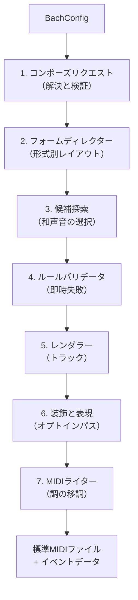
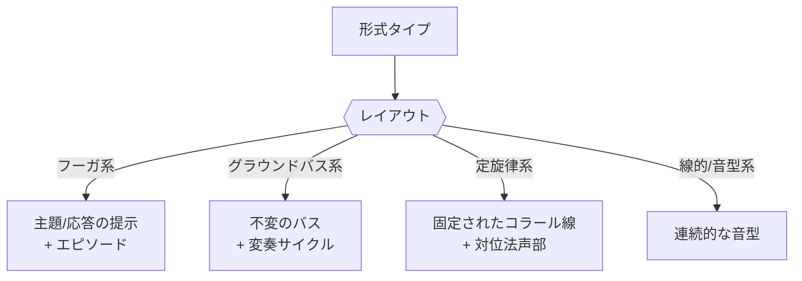

# 生成パイプライン

`generator.generate(config)` を呼び出すと、コンポーザーエンジンはリクエストを完全かつ決定論的な楽曲へと変換する固定のパイプラインを実行します。


```mermaid
graph TD
    A["BachConfig"] --> B["1. コンポーズリクエスト<br>（解決と検証）"]
    B --> C["2. フォームディレクター<br>（形式別レイアウト）"]
    C --> D["3. 候補探索<br>（和声音の選択）"]
    D --> E["4. ルールバリデータ<br>（即時失敗）"]
    E --> F["5. レンダラー<br>（トラック）"]
    F --> G["6. 装飾と表現<br>（オプトインパス）"]
    G --> H["7. MIDIライター<br>（調の移調）"]
    H --> I["標準MIDIファイル<br>+ イベントデータ"]
```

パイプライン全体は決定論的です。同じ設定とシードは常にバイト単位で同一の出力を生成します。

## ステップ1: コンポーズリクエスト

生の設定がコンポーズリクエストに解決されます。デフォルトが補完され、シードが解決され（`seed` が `0` の場合は具体的な非ゼロ値となり、`getInfo().seedUsed` で報告）、リクエストが検証されます。

検証は厳格です。不明な `form`/`character`/`instrument`/`scale` の値や範囲外の `bpm`、および禁止されたキャラクター/形式の組み合わせ（`chorale_prelude` は `playful`/`restless` を、`toccata_and_fugue` は `noble` を拒否）は却下されます。`form` は声部数・拍子・自然長を固定し、`scale`/`targetBars` が最終的な小節数を解決します（形式の刻みにスナップし `[最小, 128]` にクランプ）。

## ステップ2: フォームディレクター

フォームディレクターが楽曲をレイアウトします。選択された形式に対し、**ボイスインテント**を小節スパンに割り当てます — 主題と応答、グラウンドバス、定旋律、音型、変奏素材を解決された長さにわたって配置します。


```mermaid
graph TD
    A["形式タイプ"] --> B{{"レイアウト"}}
    B -->|"フーガ系"| C["主題/応答の提示<br>+ エピソード"]
    B -->|"グラウンドバス系"| D["不変のバス<br>+ 変奏サイクル"]
    B -->|"定旋律系"| E["固定されたコラール線<br>+ 対位法声部"]
    B -->|"線的/音型系"| F["連続的な音型"]
```

レイアウトは**デザイン値のアーク** — 提示、展開、スパンの約80%でのクライマックス、解決 — に従い、下流で使用する密度・音域・ベロシティの段階を駆動します。アークは形式により固定され、探索されません。

## ステップ3: 候補探索

和声プラン（和音、転調、カデンツ）に対し、候補探索が固定でない各声部のノートを選択します。選択は**拍ごとに和声音へ固定**されます。各拍で、和声と他声部に協和するピッチを優先し、最初の選択が制約に違反する場合はランク付けされた代替候補へフォールバックします。フォームディレクターが割り当てた素材（主題、グラウンド、定旋律）は固定され、ここでは再選択されません。

## ステップ4: ルールバリデータ

バリデータは組み上がった声部を対位法・構造ルールに対して検査し、違反があれば即座に失敗します。該当スパンを特定できるよう、ルール識別子とともに失敗を報告します。ルールセットは[対位法と声部進行](/ja/docs/counterpoint)を参照してください。

## ステップ5: レンダラー

検証された声部がトラックへとレンダリングされます — 声部ごとに1トラック — チャンネル、楽器のGeneral MIDIプログラム、ノートのタイミングを伴います。

## ステップ6: 装飾と表現（オプトイン）

決定論的な後処理パスがレンダリング済みトラックを装飾します。

- **装飾** — トリル、モルデント、ナッハシュラーク。密度はキャラクターと楽器に依存します。グラウンドバスと定旋律の線は決して装飾されません。
- **表現** — 形式のエネルギーアークに従うオルガンレジストレーションのCC#7/#11カーブ、および終結のリタルダンドのテンポイベント。

これらのパスが追加したノートは `source: "ornament"` 由来タグを持ちます（`"material"` と `"compose"` に対して）。

## ステップ7: MIDIライター

内部表現はすべてCで作曲されます。MIDIライターは、指定された `key` が適用される**唯一の**場所です — ピッチは出力時に移調され、拍子記号が書き込まれ（パッサカリアとシャコンヌは3/4、それ以外は4/4）、結果はType 1標準MIDIファイルとなります。

```js
const midi = generator.getMidi()       // Uint8Array（選択した調に移調）
const events = generator.getEvents()   // イベントデータ（ピッチはCのまま）
```

::: tip
`getEvents()` のイベントJSONはピッチをCで報告し、すべてのノートに `source` タグを付与します。完全な型定義は[JavaScript API](/ja/docs/api-js#eventdata)を参照してください。
:::
