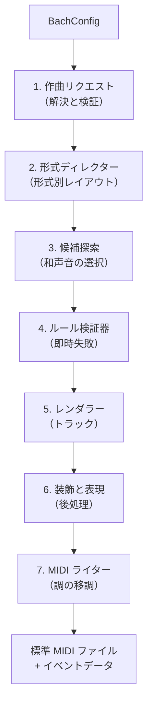
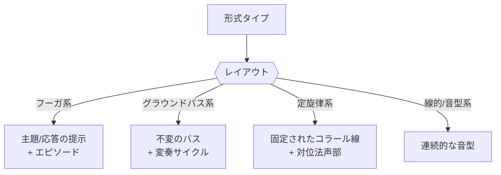

# 生成パイプライン

`generator.generate(config)` を呼び出すと、作曲エンジンはリクエストを完全かつ決定論的な楽曲へと変換する固定のパイプラインを実行します。

::: info このパイプラインでの音楽用語
このパイプラインでは、音楽を構造化データとして扱います。形式が声部を割り当て、和声が和音ターゲットを与え、候補探索が音を選び、検証が違法な声部関係を弾きます。短い用語集は[エンジニアのための音楽用語入門](/ja/docs/music-primer)にあります。
:::


```mermaid
graph TD
    A["BachConfig"] --> B["1. 作曲リクエスト<br>（解決と検証）"]
    B --> C["2. 形式ディレクター<br>（形式別レイアウト）"]
    C --> D["3. 候補探索<br>（和声音の選択）"]
    D --> E["4. ルール検証器<br>（即時失敗）"]
    E --> F["5. レンダラー<br>（トラック）"]
    F --> G["6. 装飾と表現<br>（後処理）"]
    G --> H["7. MIDI ライター<br>（調の移調）"]
    H --> I["標準 MIDI ファイル<br>+ イベントデータ"]
```

パイプライン全体は決定論的です。同じ設定とシードは常にバイト単位で同一の出力を生成します。

## ステップ1: 作曲リクエスト

生の設定が作曲リクエストに解決されます。既定が補完され、シードが解決され（`seed` が `0` の場合は具体的な非ゼロ値となり、`getInfo().seedUsed` で報告）、リクエストが検証されます。

検証は厳格です。不明な `form`/`character`/`instrument`/`scale` の値や範囲外の `bpm`、および禁止された性格と形式の組み合わせ（`chorale_prelude` は `playful`/`restless` を、`toccata_and_fugue` は `noble` を拒否）は却下されます。`form` は声部数・拍子・基準長を固定し、`scale`/`targetBars` が最終的な小節数を解決します（形式の刻みにスナップし `[最小, 128]` に丸め込み）。

## ステップ2: 形式ディレクター

形式ディレクターが楽曲をレイアウトします。選択された形式に対し、**ボイスインテント**を小節スパンに割り当てます — 主題と応答、グラウンドバス、定旋律、音型、変奏素材を解決された長さにわたって配置します。

::: info 小節スパンと素材
**小節スパン**は、連続する小節の範囲です。**素材**は、フーガ主題や反復するグラウンドバスのように、候補探索が自由に置き換えるのではなく尊重すべき事前定義の音楽内容です。
:::


```mermaid
graph TD
    A["形式タイプ"] --> B{{"レイアウト"}}
    B -->|"フーガ系"| C["主題/応答の提示<br>+ エピソード"]
    B -->|"グラウンドバス系"| D["不変のバス<br>+ 変奏サイクル"]
    B -->|"定旋律系"| E["固定されたコラール線<br>+ 対位法声部"]
    B -->|"線的/音型系"| F["連続的な音型"]
```

レイアウトは**デザイン値のアーク** — 提示、展開、スパンの約80%でのクライマックス、解決 — に従い、下流で使用する密度・音域・ベロシティの段階を駆動します。アークは形式により固定され、探索されません。

## ステップ3: 候補探索

和声プラン（和音、転調、カデンツ）に対し、候補探索が固定でない各声部のノートを選択します。選択は**拍ごとに和声音へ固定**されます。各拍で、和声と他声部に協和するピッチを優先し、最初の選択が制約に違反する場合はランク付けされた代替候補へ切り替えます。形式ディレクターが割り当てた素材（主題、グラウンド、定旋律）は固定され、ここでは再選択されません。

::: info 和音、転調、カデンツ
**和音**は各時点の縦のターゲットです。**転調**は音楽上の中心を別の調へ移すことです。**カデンツ**、つまり終止はフレーズの終わり方で、典型的には V から I のような属和音から主和音への到着です。
:::

## ステップ4: ルール検証器

検証器は組み上がった声部を対位法・構造ルールに対して検査し、違反があれば即座に失敗します。該当スパンを特定できるよう、ルール識別子とともに失敗を報告します。音楽上の考え方は[対位法コース](/ja/docs/counterpoint)で学び、特定のルール ID を調べるときは[検証器ルール一覧](/ja/docs/validator-rules)を使います。

::: info ここでの即時失敗とは
エンジンは、不適切な候補に含まれるすべての音楽上の問題を列挙するわけではありません。その処理で最初に違反したルールで停止し、ルール識別子を返し、探索または呼び出し側がその候補を扱います。
:::

## ステップ5: レンダラー

検証された声部がトラックへとレンダリングされます — 声部ごとに1トラック — チャンネル、楽器のGeneral MIDI プログラム、ノートのタイミングを伴います。

::: info `source` タグはレンダリング後も残ります
レンダリングされた音は由来を保ちます。固定素材は `"material"`、候補探索で選ばれた音は `"compose"`、後から追加された装飾は `"ornament"` です。どの音がルールによって書き換え可能だったのかを調べるときに役立ちます。
:::

## ステップ6: 装飾と表現（後処理）

決定論的な後処理がレンダリング済みトラックを装飾します。C++ ライブラリの層では装飾処理は独立した関数（`applyOrnamentPass`）で、意図的に `Composer::run()` の外に置かれています。JavaScript API・CLI・このデモが使う公開生成経路 `bach_generate_from_json` は、検証のあとで必ずこの処理を呼び出します。

- **装飾** — トリル、モルデント、ナッハシュラーク。密度は性格と楽器に依存します。グラウンドバスと定旋律の線は決して装飾されません。
- **表現** — 形式のエネルギーアークに従うオルガンレジストレーションのCC#7/#11カーブ、および終結のリタルダンドのテンポイベント。

これらの処理が追加したノートは `source: "ornament"` 由来タグを持ちます（`"material"` と `"compose"` に対して）。

::: info 装飾
**装飾**は、構造上の音の周辺に追加される小さな飾りの音型です。元の主旋律そのものではないため、イベントデータでは `source: "ornament"` として区別されます。
:::

## ステップ7: MIDI ライター

内部表現はすべて C で作曲されます。MIDI ライターは、指定された `key` が適用される**唯一の**場所です — ピッチは出力時に移調され、拍子記号が書き込まれ（パッサカリアとシャコンヌは3/4、それ以外は4/4）、結果はType 1 の標準 MIDI ファイルとなります。

```js
const midi = generator.getMidi()       // Uint8Array（選択した調に移調）
const events = generator.getEvents()   // イベントデータ（ピッチは C のまま）
```

::: tip
`getEvents()` のイベント JSON はピッチを C で報告し、すべてのノートに `source` タグを付与します。完全な型定義は[JavaScript API](/ja/docs/api-js#eventdata)を参照してください。
:::
