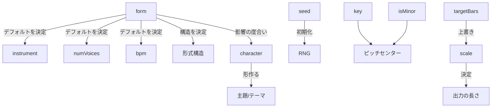
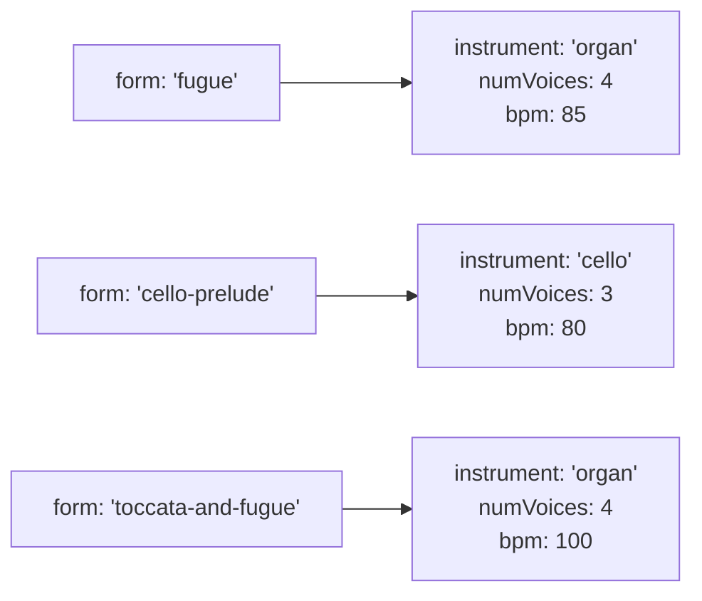

# オプション関係

MIDI Sketch Bachの設定オプションは特定の方法で相互に作用します。これらの関係を理解することで、望む結果を生む設定を作成する助けになります。

## 依存関係の概要



## 楽曲形式がデフォルトを決定

`form` パラメータは最も影響力のある設定オプションです。`instrument`、`numVoices`、`bpm` のデフォルト値を決定します。



### デフォルトの連鎖

形式を指定すると、未指定フィールドにデフォルトが適用されます。

```js
// 指定内容:
generator.generate({ form: 'fugue', key: 2, isMinor: true })

// エンジンが解決する値:
// {
//   form: 0,
//   key: 2,
//   isMinor: true,
//   instrument: 0,    ← 形式デフォルト（オルガン）
//   numVoices: 4,     ← 形式デフォルト
//   bpm: 85,          ← 形式デフォルト
//   seed: 0,          ← ランダム
//   character: 0,     ← バランス型
//   scale: 1,         ← medium
// }
```

明示的に設定したフィールドは形式デフォルトを上書きします。

```js
// 楽器とBPMを上書き
generator.generate({
  form: 'fugue',
  instrument: 'harpsichord',  // オルガンを上書き
  bpm: 72                     // 85を上書き
})
```

完全なデフォルトテーブルについては[プリセットリファレンス](/ja/docs/presets)をご覧ください。

## 声部数の制約

`numVoices` パラメータの有効範囲は形式に依存します。

| 形式 | デフォルト | 最小 | 最大 | 備考 |
|------|---------|------|------|------|
| 0: フーガ | 4 | 2 | 5 | |
| 1: 前奏曲とフーガ | 4 | 2 | 5 | |
| 2: トリオ・ソナタ | 3 | 3 | 3 | 3で固定 |
| 3: コラール前奏曲 | 4 | 3 | 5 | 定旋律 + 2伴奏に最低3が必要 |
| 4: トッカータとフーガ | 4 | 3 | 5 | |
| 5: パッサカリア | 4 | 3 | 5 | |
| 6: 幻想曲とフーガ | 4 | 3 | 5 | |
| 7: チェロ前奏曲 | 3 | 2 | 3 | 独奏楽器の暗示された声部 |
| 8: シャコンヌ | 3 | 2 | 4 | 独奏楽器の暗示された声部 |

::: warning
形式の有効範囲外の `numVoices` を設定すると、エンジンは最も近い有効な値にクランプする場合があります。例えば、トリオ・ソナタに5声部を要求しても3声部が生成されます。
:::

## scale vs. targetBars

`scale` と `targetBars` パラメータはどちらも出力の長さを制御しますが、相互作用があります。

| 設定 | 動作 |
|------|------|
| `scale` のみ | 出力長はスケールレベルと形式で決定 |
| `targetBars` のみ | エンジンは指定された小節数を目標とする |
| 両方指定 | `targetBars` が `scale` を上書き |
| どちらも未指定 | デフォルト: `scale: 1`（medium） |

::: tip
一般的なサイズカテゴリが必要な場合は `scale` を使用してください（short、medium、long、full）。特定の長さが必要な場合は `targetBars` を使用してください。音楽フレーズは自然な境界で終わる必要があるため、実際の出力は `targetBars` と若干異なる場合があります。
:::

```js
// 一般的な長さの制御
generator.generate({ form: 'fugue', scale: 'long' })

// 特定の長さの制御
generator.generate({ form: 'fugue', targetBars: 48 })

// 両方指定時はtargetBarsが優先
generator.generate({
  form: 'fugue',
  scale: 'short',      // 無視される
  targetBars: 48        // これが使用される
})
```

## シードの動作

`seed` パラメータは決定論的出力を制御します。

| シード値 | 動作 |
|---------|------|
| `0`（デフォルト） | ランダムシード — 毎回異なる出力 |
| 正の整数 | 決定論的 — 同じ設定 + 同じシード = 同じ出力 |

::: warning 再現性
決定論的再現には同じバージョンのMIDI Sketch Bachが必要です。内部アルゴリズムはバージョン間で変更される可能性があるため、アップグレード後に同じシードが異なる出力を生成する場合があります。特定の出力を保存する必要がある場合は、バージョン間のシード再現性に頼るのではなく、生成されたMIDIファイルを保存してください。
:::

```js
// 毎回ランダム
generator.generate({ form: 'fugue', seed: 0 })

// 常に同じ結果
generator.generate({ form: 'fugue', key: 2, isMinor: true, seed: 42 })

// 調が異なれば同じシードでも出力は異なる
generator.generate({ form: 'fugue', key: 0, isMinor: true, seed: 42 })
```

## 調と旋法

`key` と `isMinor` パラメータは連携して調中心を定義します。

```js
// ニ長調
generator.generate({ key: 2, isMinor: false })

// ニ短調
generator.generate({ key: 2, isMinor: true })
```

| パラメータ | 範囲 | デフォルト |
|-----------|------|---------|
| `key` | 0--11（ピッチクラス） | 0（C） |
| `isMinor` | `true` / `false` | `false`（長調） |

調は以下に影響します：
- 楽曲のピッチセンターと音階
- エンジンが利用できる和声語彙
- 転調の目標（関連調）

## キャラクターと形式

`character` パラメータの影響は形式タイプによって異なります。

| 形式タイプ | キャラクターの影響 |
|-----------|-----------------|
| フーガ系形式（0, 1, 4, 6） | **強い** — フーガ主題を直接形作り、楽曲全体を定義 |
| 変奏形式（5, 8） | **中程度** — バス主題と変奏の性格に影響 |
| コラール前奏曲（3） | **中程度** — 伴奏声部に影響、定旋律は固定 |
| トリオ・ソナタ（2） | **中程度** — 両方の上声部の動機素材を形作る |
| チェロ前奏曲（7） | **中程度** — 音型パターンに影響 |

::: tip
キャラクター0（バランス型）はほとんどの状況で良いデフォルトです。トッカータとフーガにはキャラクター3（劇的）を、コラール前奏曲にはキャラクター1（叙情的）を試してみてください。
:::

## 検証ルール

すべての設定フィールドの完全な検証制約：

| フィールド | 型 | 範囲 | デフォルト | 検証 |
|-----------|------|------|---------|------|
| `form` | number または string | 0--8 | 0 | 有効範囲にクランプ |
| `key` | number | 0--11 | 0 | 有効範囲にクランプ |
| `isMinor` | boolean | true/false | false | -- |
| `numVoices` | number | 形式依存（2--5） | 形式デフォルト | 形式の有効範囲にクランプ |
| `bpm` | number | 40--200 | 形式デフォルト | 0は形式デフォルトを使用；それ以外はクランプ |
| `seed` | number | 0+ | 0 | 0 = ランダム |
| `character` | number または string | 0--3 | 0 | 有効範囲にクランプ |
| `instrument` | number または string | 0--5 | 形式デフォルト | 有効範囲にクランプ |
| `scale` | number または string | 0--3 | 1 | 有効範囲にクランプ |
| `targetBars` | number | 1+ | -- | 指定時にscaleを上書き |
