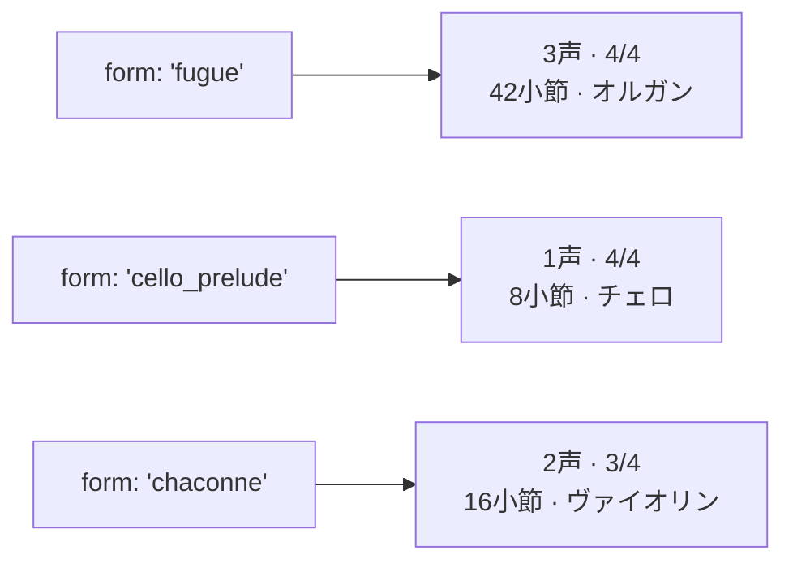

# オプション関係

MIDI Sketch Bachの設定オプションは特定の方法で相互に作用します。これらの関係を理解することで、望む結果を生む設定を作成する助けになります。

## 依存関係の概要


```mermaid
graph TD
    A["form"] -->|"固定"| C["声部数"]
    A -->|"デフォルトを決定"| B["instrument"]
    A -->|"構造と拍子を決定"| E["形式構造"]
    A -->|"自然長を設定"| P["自然長"]
    F["scale"] -->|"倍率"| P
    P --> G["出力の長さ"]
    H["targetBars"] -->|"上書き"| F
    I["seed"] -->|"初期化"| J["RNG"]
    K["key"] --> L["ピッチセンター（MIDI出力時に適用）"]
    M["isMinor"] --> L
    N["character"] -->|"形作る"| O["主題/テーマ"]
    A -->|"禁止する場合あり"| N
```

## 声部数は形式が決定

`form` は最も影響力のあるオプションです。声部数・拍子・自然長を**固定**し、デフォルトの `instrument` を選択します。


```mermaid
graph LR
    A["form: 'fugue'"] --> B["3声 · 4/4<br>42小節 · オルガン"]
    C["form: 'cello_prelude'"] --> D["1声 · 4/4<br>8小節 · チェロ"]
    E["form: 'chaconne'"] --> F["2声 · 3/4<br>16小節 · ヴァイオリン"]
```

::: warning `numVoices` は廃止されました
声部数オプションは存在しません — テクスチュアを選ぶには形式を選びます（[楽曲形式](/ja/docs/forms)の表を参照）。後方互換のため `num_voices`/`numVoices` の指定は受理されますが無視されます。エラーにはならず、効果もありません。
:::

### デフォルトの連鎖

形式を指定すると、エンジンが未指定フィールドを補完します。

```js
// 指定内容:
generator.generate({ form: 'fugue', key: 2, isMinor: true })

// エンジンが解決する値:
// {
//   form: 'fugue',
//   key: 2,
//   isMinor: true,
//   instrument: 'organ',  ← 形式デフォルト
//   bpm: 100,             ← デフォルト
//   seed: 0,              ← ランダム（解決済みシードは getInfo().seedUsed）
//   character: 'severe',  ← デフォルト
//   scale: 'short',       ← デフォルト（≒ 自然長）
// }
// 声部数（3）、拍子（4/4）、自然長（42小節）は形式から決まります。
```

明示的に設定したフィールドはデフォルトを上書きします。

```js
// 楽器とBPMを上書き
generator.generate({
  form: 'fugue',
  instrument: 'harpsichord',  // オルガンを上書き
  bpm: 72                     // デフォルトの100を上書き
})
```

形式ごとの声部数は[楽曲形式](/ja/docs/forms)の表を、完全なデフォルトテーブルは[プリセットリファレンス](/ja/docs/presets)をご覧ください。

## 楽器のデフォルト

各形式はデフォルトの楽器を選択しますが、任意の楽器に差し替えできます。

| 形式 | デフォルト楽器 |
|------|--------------|
| `fugue`、`prelude_and_fugue`、`trio_sonata`、`chorale_prelude`、`toccata_and_fugue`、`passacaglia`、`fantasia_and_fugue` | オルガン |
| `cello_prelude` | チェロ |
| `chaconne` | ヴァイオリン |
| `goldberg_variations` | ハープシコード |

`instrument` の選択は、General MIDIプログラム、生成時に使う演奏可能音域、装飾パスの装飾密度に影響します。無効な楽器文字列はスローします。

## scale と targetBars

`scale` と `targetBars` はどちらも出力の長さを設定します。`scale` は形式の自然長に対する倍率、`targetBars` は明示的な上書きです。

| 設定 | 動作 |
|------|------|
| `scale` のみ | 長さ = 形式の自然長 × スケール倍率 |
| `targetBars` のみ | エンジンはその小節数を目標とする |
| 両方指定 | `targetBars` が優先；`scale` は無視 |
| どちらも未指定 | デフォルト: `scale: "short"`（≒ 自然長） |

スケール倍率はおおよそ `short` ≒ 1倍、`medium` ≒ 2倍、`long` ≒ 3倍、`full` ≒ 4倍です。

::: tip
`targetBars` は形式の刻み（グラウンドバスの周期など）にスナップされ、`[形式の最小値, 128]` にクランプされます。すべての形式は128小節で上限となります。一般的なサイズカテゴリには `scale`、特定の長さには `targetBars` を使用してください。
:::

```js
// 形式の自然長の倍率で長さを指定
generator.generate({ form: 'fugue', scale: 'long' })   // ≒ 3 × 42小節

// 特定の長さ（スナップ・クランプあり）
generator.generate({ form: 'fugue', targetBars: 48 })

// 両方指定時はtargetBarsが優先
generator.generate({
  form: 'fugue',
  scale: 'short',      // 無視される
  targetBars: 48        // これが使用される
})
```

## シードの動作

`seed` パラメータは決定論的出力を制御します。

| シード値 | 動作 |
|---------|------|
| `0`（デフォルト） | 非ゼロのランダムシードが選ばれ、解決値は `getInfo().seedUsed` で報告 |
| 正の整数 | 決定論的 — 同じ設定 + 同じシード = バイト単位で同一の出力 |

::: tip ランダム実行の再現
`seed: 0` の実行後に `getInfo().seedUsed` を読み取り、それを `seed` として渡し直すと、まったく同じ楽曲を再生成できます。
:::

::: warning 再現性
決定論的再現には同じバージョンのMIDI Sketch Bachが必要です。内部アルゴリズムはバージョン間で変更される可能性があるため、アップグレード後に同じシードが異なる出力を生成する場合があります。特定の出力を保存する必要がある場合は、バージョン間のシード再現性に頼るのではなく、生成されたMIDIファイルを保存してください。
:::

```js
// 毎回ランダム
generator.generate({ form: 'fugue', seed: 0 })

// 常に同じ結果
generator.generate({ form: 'fugue', key: 2, isMinor: true, seed: 42 })

// 調が異なれば同じシードでも出力は異なる
generator.generate({ form: 'fugue', key: 0, isMinor: true, seed: 42 })
```

## 調と旋法

`key` と `isMinor` パラメータは連携して調中心を定義します。

```js
// ニ長調
generator.generate({ key: 2, isMinor: false })

// ニ短調
generator.generate({ key: 2, isMinor: true })
```

| パラメータ | 範囲 | デフォルト |
|-----------|------|---------|
| `key` | 0--11（ピッチクラス） | 0（C） |
| `isMinor` | `true` / `false` | `false`（長調） |

調は以下に影響します：
- 楽曲のピッチセンターと音階
- エンジンが利用できる和声語彙
- 転調の目標（関連調）

## キャラクターと形式

`character` パラメータ（`severe`、`playful`、`noble`、`restless`）は主要な主題素材を形作ります。影響は形式により異なり、一部の組み合わせは禁止されています。

| 形式タイプ | キャラクターの影響 |
|-----------|-----------------|
| フーガ系形式（`fugue`、`prelude_and_fugue`、`toccata_and_fugue`、`fantasia_and_fugue`） | **強い** — フーガ主題を直接形作り、楽曲全体を定義 |
| 変奏形式（`passacaglia`、`chaconne`、`goldberg_variations`） | **中程度** — 固定バス上の変奏に色付け |
| コラール前奏曲 | **中程度** — 対位法声部に影響、定旋律は固定 |
| トリオ・ソナタ | **中程度** — 上声部の動機素材を形作る |
| チェロ前奏曲 | **中程度** — 音型パターンに影響 |

::: warning 禁止されたキャラクター/形式の組み合わせ（スローします）
- `chorale_prelude` は `playful` と `restless` を拒否します。
- `toccata_and_fugue` は `noble` を拒否します。

禁止された組み合わせを要求すると、暗黙的にキャラクターを差し替えるのではなくスローします。
:::

::: tip
`severe` はほとんどの状況で堅実なデフォルトです。トッカータとフーガには `restless` を、コラール前奏曲には `noble` を試してみてください。
:::

## 検証ルール

すべての設定フィールドの完全な検証制約。いくつかのフィールドはクランプではなく無効入力で**スロー**するようになりました。

| フィールド | 型 | 範囲 | デフォルト | 検証 |
|-----------|------|------|---------|------|
| `form` | number または string | 0--9 / 名前 | `"fugue"` | 不明な名前 / 範囲外の番号はスロー |
| `key` | number | 0--11 | 0 | 範囲外はスロー |
| `isMinor` | boolean | true/false | false | -- |
| `bpm` | number | 0 または 40--200 | 100 | 0はデフォルト100を使用；それ以外の範囲外はスロー |
| `seed` | number | 0+ | 0 | 0 = ランダム；解決値は `getInfo().seedUsed` |
| `character` | string または number | 名前 / 0--3 | `"severe"` | 不明な値はスロー；禁止された形式の組み合わせはスロー |
| `instrument` | string または number | 名前 / 0--5 | 形式デフォルト | 不明な値はスロー |
| `scale` | string または number | 名前 / 0--3 | `"short"` | 不明な値はスロー |
| `targetBars` | number | >0 | -- | scaleを上書き；形式の刻みにスナップし `[最小, 128]` にクランプ |
| `numVoices` | number | -- | -- | 受理されるが無視（声部数は形式が決定） |
