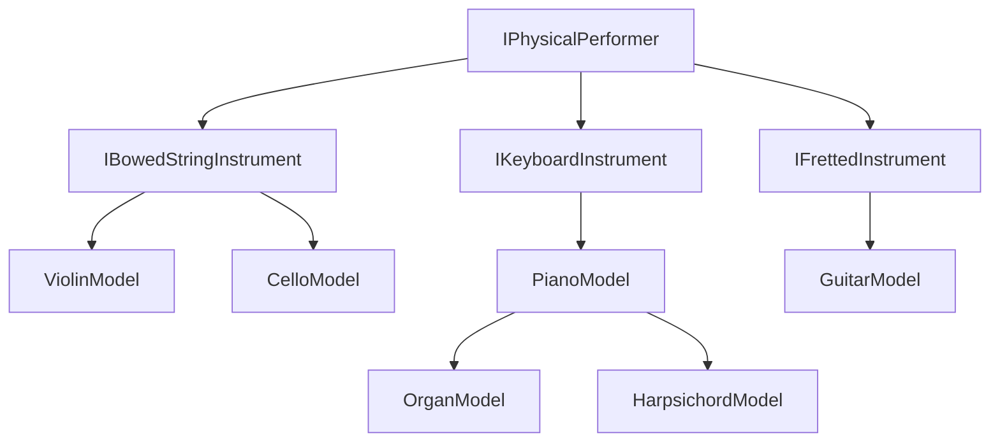
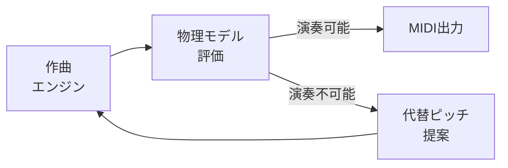

# 物理楽器モデル

MIDI Sketch Bachには、6種類の楽器の物理モデルが搭載されています。これらのモデルは、生成された音符が現代楽器で物理的に演奏可能かどうかを評価し、各楽器にとって自然で快適なパッセージへと生成エンジンを導きます。

::: info 設計原則
物理演奏モデルは音楽を**生成しません** — 生成された音楽が物理的に演奏可能かどうかを**評価**します。この分離により、作曲ロジックは楽器固有の制約から独立して動作します。
:::

## 概要

すべての楽器モデルは共通インターフェース（`IPhysicalPerformer`）を実装しており、以下の機能を提供します：

| メソッド | 目的 |
|---------|------|
| `canPerform(pitch, start, duration)` | 演奏可能性の判定 |
| `calculateCost(pitch, start, duration, state)` | エルゴノミクス難易度スコア（0.0 = 容易、値が大きいほど困難） |
| `suggestAlternatives(pitch, ...)` | 指定ピッチが演奏不可能な場合の代替ピッチリスト |
| `updateState(state, pitch, start, duration)` | 演奏者の状態を追跡（手の位置、疲労度、弓の方向など） |

コストベースのアプローチにより、生成パイプラインはピッチを単純に受理・棄却するのではなく、複数の有効な選択肢の中から最も自然なものを選ぶことができます。

## 楽器カテゴリ

## 弓弦楽器

### バイオリン

| プロパティ | 値 |
|-----------|-----|
| 調弦 | G3, D4, A4, E5（MIDI 55, 62, 69, 76） |
| 音域 | G3–C7（MIDI 55–96） |
| 弦数 | 4 |

バイオリンモデルが考慮する要素：

- **ポジション移動** — 距離に応じてコストが増加。高ポジション（第5以上）には追加ペナルティ（`kHighPositionCost = 0.15`）
- **弦の移動** — 弦をまたぐごとにペナルティ（`kStringCrossCostPerString = 0.08`）
- **重音** — 隣接する弦のみで演奏可能
- **和音のアルペジオ** — 3音以上の和音は分散奏法が必要（弓で3弦を同時に持続できないため）
- **バリオラージュ** — E弦とA弦を中心にサポート

### チェロ

| プロパティ | 値 |
|-----------|-----|
| 調弦 | C2, G2, D3, A3（MIDI 36, 43, 50, 57） |
| 音域 | C2–A5（MIDI 36–81） |
| 弦数 | 4 |

チェロモデルはバイオリンと同じ弓弦楽器の力学を共有しますが、重要な違いがあります：

- **高いシフトコスト** — 弦長が長いため、ポジション移動のコストが高い（`kShiftCostPerPosition = 0.15`、バイオリンは`0.1`）
- **親指ポジション** — 各弦の一定のピッチ以上で必要となり、大きなコストが加算される（`kThumbPositionCost = 0.3`）
- **拡張された高音域** — A弦は親指ポジションにより、開放弦から24半音上まで到達可能

### 弓弦楽器の共通機能

#### 弓の方向

弓の方向は伝統的な演奏慣習に従って自動的に割り当てられます：

- **ダウンボウ** — 小節の開始（強拍）
- **アップ・ダウンの交互** — 後続の音符
- **ナチュラル**（演奏者の判断） — 3弦以上をまたぐ場合
- **方向の維持** — スラーグループ（連続する順次進行）

#### ナチュラルハーモニクス

エンジンは2つの位置でナチュラルハーモニクスを検出・マークします：

| ハーモニクス | 弦の分割 | 開放弦からの音程 |
|------------|---------|---------------|
| オクターブ | 1/2の長さ | +12半音 |
| 5度 | 1/3の長さ | +19半音 |

ハーモニクスはクライマックスの瞬間（ピークアークフェーズ）に限定され、十分な音価が必要です。

## 鍵盤楽器

### ピアノ

| プロパティ | 値 |
|-----------|-----|
| 音域 | A0–C8（MIDI 21–108） |
| ベロシティ対応 | あり |

ピアノモデルは、設定可能なスキルレベルに基づいて手の割り当てと演奏可能性を評価します：

| スキルレベル | 通常スパン | 最大スパン | 片手の最大音数 |
|------------|-----------|-----------|-------------|
| 初級 | 7半音 | 9半音 | 4 |
| 中級 | 9半音 | 11半音 | 5 |
| 上級 | 10半音 | 12半音 | 5 |
| 超絶技巧 | 12半音 | 14半音 | 5 |

主な機能：

- **手の割り当て** — ピッチを左手・右手に自動配分
- **遷移コスト** — 跳躍、伸張、交差、同音反復を評価
- **疲労度の追跡** — 持続的なパッセージにおける手の疲労をモデル化

### オルガン

| プロパティ | 値 |
|-----------|-----|
| 鍵盤 | グレート（I）、スウェル（II）、ポジティフ（III）、ペダル |
| ベロシティ対応 | なし（固定ベロシティ 80） |

オルガンモデルはピアノモデルを拡張し、複数鍵盤とペダルボードをサポートします：

| 鍵盤 | 音域 | MIDIチャンネル | GMプログラム |
|------|------|-------------|------------|
| グレート | C2–C6（MIDI 36–96） | 0 | 19（チャーチオルガン） |
| スウェル | C2–C6（MIDI 36–96） | 1 | 20（リードオルガン） |
| ポジティフ | C3–C6（MIDI 48–96） | 2 | 19（チャーチオルガン） |
| ペダル | C1–D3（MIDI 24–50） | 3 | 19（チャーチオルガン） |

- オルガニストは超絶技巧レベルの技量を前提としています
- 適正音域外のペダルノートには急峻なペナルティ（半音あたり5.0）が課されます

### チェンバロ

| プロパティ | 値 |
|-----------|-----|
| 音域 | F1–F6（MIDI 29–89） |
| 鍵盤数 | 2（上段、下段） |
| ベロシティ対応 | なし（プラクトラム機構、固定ベロシティ 80） |

- 上級レベルのスパン制約を使用
- 現代のピアノより狭い音域

## フレット楽器

### ギター

| プロパティ | 値 |
|-----------|-----|
| 調弦 | E2, A2, D3, G3, B3, E4（MIDI 40, 45, 50, 55, 59, 64） |
| 音域 | E2–B5（MIDI 40–83） |
| 弦数 | 6 |
| フレット数 | 19 |

ギターモデルはフレット位置とエルゴノミクス的な遷移コストを評価します：

| コスト要素 | 説明 | 基本コスト |
|-----------|------|-----------|
| ストレッチ | ポジション内での指の伸張（快適スパン：4フレット） | フレットあたり0.1 |
| ストレッチ（スパン超過） | 快適な4フレットスパンを超える場合 | 0.4 + 超過フレットあたり0.3 |
| ポジション移動 | 手を新しいポジションに移動 | 0.5 + 超過フレットあたり0.2 |
| 弦の移動 | 弦間の移動 | 弦あたり0.05 |
| セーハ | 人差し指を寝かせて同一フレットの複数弦を押さえる | 和音コストに加算 |

セーハ（バレー）は、人差し指を寝かせて同一フレット上の複数弦を同時に押さえるギターの基本テクニックです。モデルはこの追加的な負荷を考慮します：

- **フルセーハ** — 1つのフレットで全6弦を押さえる（例：第1ポジションのFメジャー）。持続的な指圧が必要なため高コスト。
- **ハーフセーハ** — 2〜3弦を押さえる。フルセーハより低コスト。
- **セーハ＋運指** — セーハの上方で残りの指が個別の音をフレッティング。セーハの圧力と指の伸張のコストが合算される。
- **フレット位置の影響** — ナット付近（第1〜3フレット）のセーハは弦の張力が高いためより大きな力が必要。高フレットほど容易。

## パイプラインにおける位置づけ

物理モデル層は、作曲エンジンと最終MIDI出力の間に位置します：

生成パイプラインは各ステップで物理モデルに問い合わせます。生成された音符のコストが高い場合や演奏不可能と判定された場合、エンジンは代替案を要求し、物理的に快適でありながら音楽的に最も適切な選択肢を選びます。

::: tip
声部と楽器のマッピングについては[声部アーキテクチャ](/ja/docs/voice-architecture)を、物理モデルが生成フロー全体にどう統合されるかについては[生成パイプライン](/ja/docs/generation-pipeline)をご覧ください。
:::
