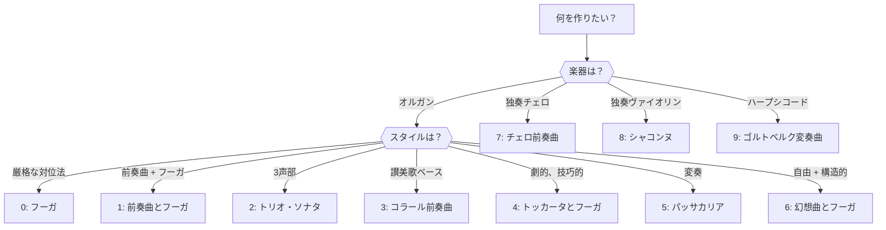

# プリセットリファレンス

MIDI Sketch Bachのすべての設定可能なプリセットの完全なリファレンスです。

## 楽曲形式リファレンス

### 全10形式

| ID | 名前 | 文字列 | カテゴリ | デフォルト楽器 | 声部数 | 拍子 | 自然小節数 |
|----|------|--------|---------|--------------|--------|------|-----------|
| 0 | フーガ | `"fugue"` | オルガン | オルガン | 3 | 4/4 | 42 |
| 1 | 前奏曲とフーガ | `"prelude_and_fugue"` | オルガン | オルガン | 3 | 4/4 | 24 |
| 2 | トリオ・ソナタ | `"trio_sonata"` | オルガン | オルガン | 3 | 4/4 | 16 |
| 3 | コラール前奏曲 | `"chorale_prelude"` | オルガン | オルガン | 2 | 4/4 | 16 |
| 4 | トッカータとフーガ | `"toccata_and_fugue"` | オルガン | オルガン | 3 | 4/4 | 32 |
| 5 | パッサカリア | `"passacaglia"` | オルガン | オルガン | 2 | 3/4 | 24 |
| 6 | 幻想曲とフーガ | `"fantasia_and_fugue"` | オルガン | オルガン | 3 | 4/4 | 32 |
| 7 | チェロ前奏曲 | `"cello_prelude"` | ソロ | チェロ | 1 | 4/4 | 8 |
| 8 | シャコンヌ | `"chaconne"` | ソロ | ヴァイオリン | 2 | 3/4 | 16 |
| 9 | ゴルトベルク変奏曲 | `"goldberg_variations"` | 変奏 | ハープシコード | 3 | 4/4 | 20 |

::: info 小節数について
「自然小節数」は `scale: "short"` のときの長さです。`scale` オプションがこれを倍率で伸ばし（約1倍/2倍/3倍/4倍）、`targetBars` が上書きします。すべての形式は128小節で上限となります。
:::

### 楽曲形式選択フローチャート


```mermaid
graph TD
    A["何を作りたい？"] --> B{{"楽器は？"}}
    B -->|"オルガン"| C{{"スタイルは？"}}
    B -->|"独奏チェロ"| D["7: チェロ前奏曲"]
    B -->|"独奏ヴァイオリン"| E["8: シャコンヌ"]
    B -->|"ハープシコード"| M["9: ゴルトベルク変奏曲"]
    C -->|"厳格な対位法"| F["0: フーガ"]
    C -->|"前奏曲 + フーガ"| G["1: 前奏曲とフーガ"]
    C -->|"3声部"| H["2: トリオ・ソナタ"]
    C -->|"讃美歌ベース"| I["3: コラール前奏曲"]
    C -->|"劇的、技巧的"| J["4: トッカータとフーガ"]
    C -->|"変奏"| K["5: パッサカリア"]
    C -->|"自由 + 構造的"| L["6: 幻想曲とフーガ"]
```

::: info オルガンシステム（形式 0--6）
7つのオルガン形式はバッハのオルガン・レパートリーの主要ジャンルをカバーします。すべてデフォルトでオルガンのレジストレーションが適用され、2--3声部を使用します。オルガンの持続音はあらゆる声部進行の細部を際立たせるため、これらの形式は最も洗練された対位法を特徴とします。
:::

::: info 独奏楽器システム（形式 7--8）
2つの独奏形式は無伴奏弦楽器のための音楽を生成します。チェロ前奏曲は単一の連続線、シャコンヌはグラウンドバスと上声部の組み合わせです。音域の移動、アルペジオ、和音的書法を通じて暗示的ポリフォニーが浮かび上がります。
:::

::: info 変奏システム（形式 9）
ゴルトベルク変奏曲形式は、不変のバス上に展開される主題と変奏のサイクルで、デフォルトはハープシコードです。
:::

::: details 形式別BWVリファレンス
| 形式 | バッハの代表作 |
|------|--------------|
| フーガ | BWV 578（ト短調「小フーガ」）、BWV 542/2 |
| 前奏曲とフーガ | BWV 532, 541, 548, 846--893（平均律クラヴィーア曲集） |
| トリオ・ソナタ | BWV 525--530（6つのトリオ・ソナタ） |
| コラール前奏曲 | BWV 599--644（オルゲルビュッヒライン）、BWV 651--668 |
| トッカータとフーガ | BWV 565（ニ短調）、BWV 540 |
| パッサカリア | BWV 582（ハ短調） |
| 幻想曲とフーガ | BWV 537, 542, 561 |
| チェロ前奏曲 | BWV 1007--1012（無伴奏チェロ組曲） |
| シャコンヌ | BWV 1004/5（パルティータ第2番ニ短調） |
| ゴルトベルク変奏曲 | BWV 988 |
:::

## 楽器リファレンス

| ID | 名前 | 文字列 | GMプログラム | サウンド | 典型的な形式 |
|----|------|--------|-----------|---------|-------------|
| 0 | オルガン | `"organ"` | 19 | チャーチオルガン | オルガン形式全般（0--6） |
| 1 | チェンバロ | `"harpsichord"` | 6 | チェンバロ | ゴルトベルク変奏曲（9）、すべての形式 |
| 2 | ピアノ | `"piano"` | 0 | アコースティックグランドピアノ | すべての形式 |
| 3 | ヴァイオリン | `"violin"` | 40 | ヴァイオリン | シャコンヌ（8） |
| 4 | チェロ | `"cello"` | 42 | チェロ | チェロ前奏曲（7） |
| 5 | ギター | `"guitar"` | 24 | ナイロンギター | ソロ形式（7--8） |

::: tip
各形式にはデフォルトの楽器がありますが、任意の楽器で上書きできます。例えば、チェンバロで演奏されるフーガはオルガンとは全く異なる性格を持ちます — チェンバロの明瞭なアタックが対位法の線をより際立たせます。
:::

## 主題キャラクター

| ID | 名前 | 文字列 | 効果 |
|----|------|--------|------|
| 0 | Severe | `"severe"` | 厳格で知的に緻密（デフォルト） |
| 1 | Playful | `"playful"` | 軽快で機敏、リズミカル |
| 2 | Noble | `"noble"` | 荘重で広やか、威厳のある |
| 3 | Restless | `"restless"` | 推進力があり半音階的で劇的 |

::: info
キャラクターパラメータはフーガ主題や主要な主題素材の旋律プロファイルに影響します。フーガ系形式で最も顕著な効果があり、主題が楽曲全体の性格を定義します。2つの組み合わせは禁止されておりスローします。`chorale_prelude` は `playful`/`restless` を、`toccata_and_fugue` は `noble` を拒否します。
:::

## スケールモード

`scale` は形式の自然長を倍率で伸ばします。`targetBars` がこれを上書きします。

| ID | 名前 | 文字列 | おおよその長さ |
|----|------|--------|-------------|
| 0 | Short | `"short"` | 自然長の約1倍（デフォルト） |
| 1 | Medium | `"medium"` | 自然長の約2倍 |
| 2 | Long | `"long"` | 自然長の約3倍 |
| 3 | Full | `"full"` | 自然長の約4倍 |

::: tip
実際の出力長は各形式の自然長に依存します（上記の楽曲形式リファレンス表を参照）。各形式は自身の自然長を基準に伸縮するため、同じ `scale` でも形式によって小節数は異なります。正確な長さの制御には `targetBars` を使用してください。値は `[形式の最小値, 128]` にクランプされます。
:::

## 調のリファレンス

| ID | 名前 | ピッチクラス | バロック時代の一般的な連想 |
|----|------|------------|------------------------|
| 0 | C | C | 純粋さ、素朴さ、明快さ |
| 1 | C# / Db | C# | 献身、深み |
| 2 | D | D | 勝利、輝き（長調）；情熱、ドラマ（短調） |
| 3 | D# / Eb | Eb | 英雄的壮大さ、高貴さ |
| 4 | E | E | 喜び、明るさ（長調）；嘆き（短調） |
| 5 | F | F | 牧歌的、穏やか |
| 6 | F# / Gb | F# | 強烈さ、輝き |
| 7 | G | G | 優美、素朴（長調）；真剣さ（短調） |
| 8 | G# / Ab | Ab | 荘厳、献身的 |
| 9 | A | A | 優しさ、優雅（長調）；穏やかな憂い（短調） |
| 10 | A# / Bb | Bb | 高貴さ、温かみ |
| 11 | B | B | 硬い輝き（長調）；沈んだ重み（短調） |

::: info バロック音楽における調の連想
バロック時代の作曲家は特定の調に感情的な質を関連付けました（*感情論 / Affektenlehre*）。ニ短調は情熱とドラマの調（BWV 565 トッカータとフーガ）であり、ハ長調は純粋さを表しました（BWV 846 前奏曲）。これらの連想は主観的で時代によって異なりますが、バッハの調の選択に影響を与えました。
:::

すべての調で `isMinor: false`（長調）と `isMinor: true`（短調）の両方が使用できます。

## デフォルトマッピング

形式デフォルトのクロスリファレンス（声部数と拍子は形式が固定。BPMは指定しない限りデフォルト100）：

| 形式 | 楽器 | 声部数 | 拍子 | 自然小節数 |
|------|------|--------|------|-----------|
| フーガ | オルガン（0） | 3 | 4/4 | 42 |
| 前奏曲とフーガ | オルガン（0） | 3 | 4/4 | 24 |
| トリオ・ソナタ | オルガン（0） | 3 | 4/4 | 16 |
| コラール前奏曲 | オルガン（0） | 2 | 4/4 | 16 |
| トッカータとフーガ | オルガン（0） | 3 | 4/4 | 32 |
| パッサカリア | オルガン（0） | 2 | 3/4 | 24 |
| 幻想曲とフーガ | オルガン（0） | 3 | 4/4 | 32 |
| チェロ前奏曲 | チェロ（4） | 1 | 4/4 | 8 |
| シャコンヌ | ヴァイオリン（3） | 2 | 3/4 | 16 |
| ゴルトベルク変奏曲 | ハープシコード（1） | 3 | 4/4 | 20 |

## プログラムによるアクセス

実行時にこれらの値にアクセスするにはプリセット列挙関数を使用します。

```js
import {
  getForms,
  getInstruments,
  getCharacters,
  getKeys,
  getScales,
  getVersion
} from '@libraz/midi-sketch-bach'

// すべての形式を一覧
const forms = getForms()
for (const form of forms) {
  console.log(`${form.index}: ${form.name}`)
}
// 0: Fugue
// 1: Prelude and Fugue
// 2: Trio Sonata
// 3: Chorale Prelude
// 4: Toccata and Fugue
// 5: Passacaglia
// 6: Fantasia and Fugue
// 7: Cello Prelude
// 8: Chaconne
// 9: Goldberg Variations

// すべての楽器を一覧
const instruments = getInstruments()
// [{ index: 0, name: "Organ" }, ...]

// すべての調を一覧
const keys = getKeys()
// [{ index: 0, name: "C" }, { index: 1, name: "C#" }, ...]
```

::: tip
これらの関数はドロップダウンや楽曲形式セレクターなどのUIコンポーネントの構築に便利です。このサイトのデモでは楽曲形式選択インターフェースの入力にこれらを使用しています。
:::
