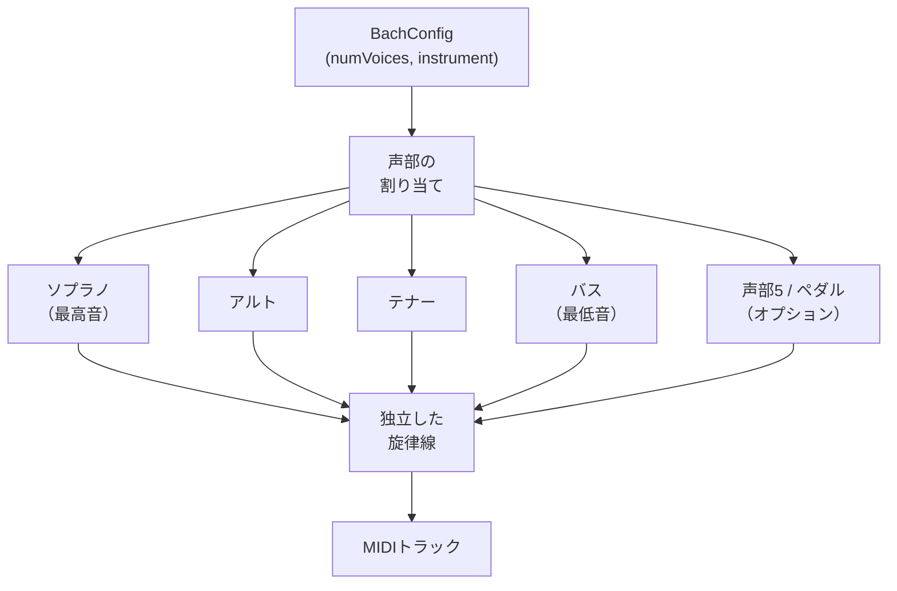

# 声部アーキテクチャ

MIDI Sketch Bachの楽曲における各声部は、バロック時代の音域、独立性、声部進行の慣習に従った独立した旋律線として機能します。

::: info 声部とは？
バロック音楽における「声部」とは、独立した旋律線のことです — 人間の声で歌われるか、楽器で演奏されるかを問いません。4声フーガには4つの同時進行する旋律線があり、それぞれが独自のリズム、輪郭、アイデンティティを持ちます。オルガンのような鍵盤楽器では、一人の演奏者がすべての声部を同時に演奏します。MIDI Sketch Bachでは、各声部が個別のMIDIトラックになります。
:::

## 声部システムの概要



## 声部のタイプと役割

| 声部 | 役割 | 音域 | 典型的な機能 |
|------|------|------|-------------|
| ソプラノ | 最高声部 | 高音域 | 主旋律、主題提示、コラール前奏曲での定旋律 |
| アルト | 内声上部 | 中高音域 | 副次的対位法、和声テクスチュアの充填 |
| テナー | 内声下部 | 中低音域 | 副次的対位法、アルトとの対話 |
| バス | 最低声部 | 低音域 | 和声的基盤、保続音、パッサカリアのバス主題 |
| 声部5（ペダル） | 拡張バス | 最低音域 | オルガンペダルバス、手鍵盤声部とは独立 |

### 声部数による声部の割り当て

| numVoices | 使用される声部 |
|-----------|---------------|
| 2 | ソプラノ、バス |
| 3 | ソプラノ、アルト、バス |
| 4 | ソプラノ、アルト、テナー、バス |
| 5 | ソプラノ、アルト、テナー、バス、ペダル |

## 声部の音域

各声部の音高範囲は楽器と声部数によって決定されます。エンジンは声部が明確さを維持するために異なる音域を占めるようにします。

::: info テッシトゥーラ
声楽と器楽において、*テッシトゥーラ*とは声部や楽器が最も良く響く快適な音域のことです — 極端な限界ではなく、中心的な作業範囲です。エンジンは各声部を主にそのテッシトゥーラ内に保ち、極端な音域は表現的効果のために控えめに使用します。
:::

### オルガンの声部音域（概算）

| 声部 | 音域 | MIDIノート番号 |
|------|------|---------------|
| ソプラノ | C4--C6 | 60--84 |
| アルト | G3--G5 | 55--79 |
| テナー | C3--C5 | 48--72 |
| バス | G2--G4 | 43--67 |
| ペダル | C2--C4 | 36--60 |

### 独奏楽器の音域

| 楽器 | 音域 | MIDIノート番号 |
|------|------|---------------|
| ヴァイオリン | G3--E7 | 55--100 |
| チェロ | C2--A5 | 36--81 |

声部数が少ない場合は音域が調整され、各声部により多くの音域空間が与えられます。

## 声部の独立性

各声部の独立性を維持することはバロック対位法の中核原則です。エンジンは3つのメカニズムを通じて独立性を確保します。

### リズムの差別化

声部は同期的に動くことを避けるために異なるリズムパターンを使用します。


ある声部が持続音を持つとき、他の声部は活発に動く傾向があり、その逆も同様です。このリズム的な相補性はバッハの対位法的書法の特徴です。

### 旋律の差別化

各声部は独自の旋律的性格を持ちます。

- 異なる音程プロファイル（順次進行が多い声部、跳躍が多い声部）
- 任意の時点で異なる方向的傾向
- 各声部が主題素材を独立して展開

### 音域の差別化

声部は音高空間での分離を維持します。

- 各声部は主に割り当てられた音域内にとどまる
- 声部交差は最小限に抑えられる
- 声部が音域で接近すると、離れる傾向がある

## 形式ごとの声部数

| 形式 | デフォルト声部数 | 有効範囲 | 備考 |
|------|----------------|---------|------|
| 0: フーガ | 4 | 2--5 | 典型的な3-4声フーガ |
| 1: 前奏曲とフーガ | 4 | 2--5 | 前奏曲はより少ない声部を使用する場合あり |
| 2: トリオ・ソナタ | 3 | 3 | 固定: 2つの上声部 + ペダルバス |
| 3: コラール前奏曲 | 4 | 3--5 | 定旋律 + 伴奏 |
| 4: トッカータとフーガ | 4 | 3--5 | トッカータは全音域を使用する場合あり |
| 5: パッサカリア | 4 | 3--5 | 変奏の進行に伴い声部数が増加する場合あり |
| 6: 幻想曲とフーガ | 4 | 3--5 | 幻想曲は可変的な声部数を使用する場合あり |
| 7: チェロ前奏曲 | 3 | 2--3 | 独奏楽器上の暗示された声部 |
| 8: シャコンヌ | 3 | 2--4 | 独奏ヴァイオリン上の暗示された声部 |

## ピアノロールの色

デモのピアノロール視覚化では、各声部にカテドラルデザインパレットから異なる色が割り当てられます。

| 声部 | 色 | Hex |
|------|------|-----|
| ソプラノ（声部1） | ゴールド | `#D4A63E` |
| アルト（声部2） | バーガンディ | `#6B1D2A` |
| テナー（声部3） | グリーン | `#2D5A3D` |
| バス（声部4） | スティールブルー | `#4A7C9B` |
| 声部5（ペダル） | ブロンズ | `#8B6914` |

## 声部からトラックへのマッピング

各声部は独自のチャンネルとプログラムを持つ個別のMIDIトラックにマッピングされます。

```js
const events = generator.getEvents()

for (const track of events.tracks) {
  console.log(`声部: ${track.name}`)      // "Soprano", "Alto" など
  console.log(`チャンネル: ${track.channel}`)  // MIDIチャンネル（0-15）
  console.log(`プログラム: ${track.program}`)  // GMプログラム番号
  console.log(`ノート数: ${track.note_count}`) // ノート数
}
```

### General MIDIプログラムマッピング

| 楽器 | GMプログラム | サウンド |
|------|-----------|---------|
| オルガン | 19 | チャーチオルガン |
| チェンバロ | 6 | チェンバロ |
| ピアノ | 0 | アコースティックグランドピアノ |
| ヴァイオリン | 40 | ヴァイオリン |
| チェロ | 42 | チェロ |
| ギター | 24 | アコースティックギター（ナイロン） |

楽曲内のすべての声部はデフォルトで同じ楽器プログラムを使用します。MIDI出力は各声部に個別のトラックを持つType 1標準MIDIファイルであり、DAWで声部ごとに楽器を再割り当てすることができます。
